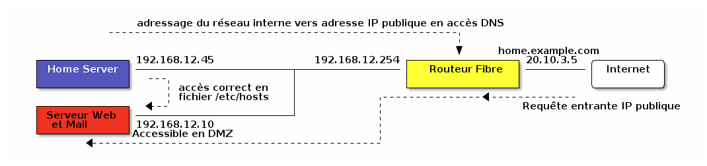

.. toctree::
   :maxdepth: 2
   :caption: Table des matières


.. _`_avant_propos`:

Avant propos
============

Ce document est disponible sur le site
`ReadTheDocs <https://serveur-home-raspberry-pi.readthedocs.io>`__

.. figure:: diag-qrcode-md5-ca9d818d3232226fdda46fca34ff0de9.svg
   :alt: Diagram

et sur `Github <https://github.com/stefapi/vps_installation>`__. Sur
Github vous trouverez aussi les versions PDF, EPUB, HTML, Docbook et
Asciidoc de ce document

Cette documentation décrit la méthode que j’ai utilisé pour installer un
serveur linux de gestion du reseau Home (site auto hébergé) avec un
raspberry PI.

Elle est le résultat de très nombreuses heures de travail pour collecter
la documentation nécessaire.

Le coût pour mettre en oeuvre ce type de serveur est relativement
faible:

-  Compter 15-18€TTC/an pour un nom de domaine classique (mais il peut y
   avoir des promos)

-  Comptez 47€ pour acheter une carte Raspberry PI 4 (1Go de Ram) et 67€
   pour un PI 4 avec 4Go de Ram ou 94€ pour un PI 5 avec 8Go de Ram. A
   cela il faut ajouter un boitier, une alim et une flash de 64 ou 128
   Go (prenez les cartes SD les plus rapide possible en écriture).

Vous en aurez donc entre 80€ pour une petite Configuration Raspberry PI
4 1Go, flash de 64 Go et 160€ pour une configuration Raspberry PI 5 8 Go
et une flash de 512 Go.

Il existe aussi des kits permettant de mettre en oeuvre des cartes NVME
avec un gros gain de performance disque.

Par rapport à une solution VPS directement dans le cloud, ce budget
correspond à 7-16 mois d’abonnement selon la configuration. Si vous avez
la Fibre chez vous, il est nettement plus rentable d’utiliser un
Raspberry que de prendre un abonnement VPS.

.. _root_login:

Se loguer root sur le serveur
=============================

A de nombreux endroit dans la documentation, il est demandé de se loguer
root sur le serveur. Pour se loguer root, et dans l’hypothèse que vous
avez mis en place un compte sudo:

1. De votre machine locale, loguez vous avec votre compte
   ``<sudo_username>``. Tapez :

   .. code:: bash

      ssh <sudo_username>@<example.com> 

   -  Mettez ici <sudo_username> par votre nom de login et <example.com>
      par votre nom de domaine ou son adresse IP. Au début votre nom de
      domaine acheté n’est pas encore configuré. Il faut donc utiliser
      le nom de machine ( par exemple pour un VPS OVH: VPSxxxxxx.ovh.net
      ou pour un raspberry: raspberrypi.local ) ou votre adresse IP.

      ou utilisez putty si vous êtes sous Windows.

2. Tapez votre mot de passe s’il est demandé. Si vous avez installé une
   clé de connexion ce ne devrait pas être le cas.

3. Loguez-vous ``root``. Tapez :

   .. code:: bash

      sudo bash

   Un mot de passe vous est demandé. Tapez le mot de passe demandé.

4. Dans le cas contraire (pas de sudo créé et connexion en root directe
   sur le serveur):

   a. Se loguer root sur le serveur distant. Tapez:

      .. code:: bash

         ssh root@<example.com> 

      -  remplacer ici <example.com> par votre nom de domaine.

         Tapez ensuite votre mot de passe root

.. _pass_gen:

Gestion des mots de passe
=========================

A propos des mots de passe: il est conseillé de saisir des mots de passe
de 12 caractères contenant des majuscules/minuscules/nombres/caractères
spéciaux. Une autre façon de faire est de saisir de longues phrases. Par
exemple: 'J’aime manger de la mousse au chocolat parfumée à la menthe'.
Ce dernier exemple a un taux de complexité bien meilleur qu’un mot de
passe classique. Il est aussi plus facile à retenir que 'Az3~1ym_a&'.

Cependant, si vous êtes en manque d’inspiration et que vous souhaitez
générer des mots de passe, voici quelques méthodes:

1. En se basant sur la date. Tapez:

   .. code:: bash

      date +%s | sha256sum | base64 | head -c 32 ; echo 

   -  remplacez 32 par la valeur qui vous convient pour générer un mot
      de passe d’une taille différente de 32 caractères

2. En se basant sur les nombres aléatoires système. Tapez l’une des deux
   lignes ci dessous :

   .. code:: bash

      tr -cd '[:graph:]' < /dev/urandom | head -c 32; echo 
      tr -cd A-Za-z0-9 < /dev/urandom | head -c 32;echo 

   -  remplacez 32 par la valeur qui vous convient pour générer un mot
      de passe d’une taille différente de 32 caractères

3. En utilisant Openssl. Tapez :

   .. code:: bash

      openssl rand -base64 32 | cut -c-32 

   -  remplacez 32 par la valeur qui vous convient pour générer un mot
      de passe d’une taille différente de 32 caractères

4. En utilisant gpg. Tapez :

   .. code:: bash

      gpg --gen-random --armor 1 32 | cut -c-32 

   -  remplacez 32 par la valeur qui vous convient pour générer un mot
      de passe d’une taille différente de 32 caractères

5. En utilisant pwgen pour générer des mots de passe qui suivent des
   règles de longueur et types de caractères.

   a. Pour installer l’outil, tapez:

      .. code:: bash

         apt install pwgen

   b. Ensuite tapez :

      .. code:: bash

         pwgen -Bcny 32 -1 

      -  remplacez 32 par la valeur qui vous convient pour générer un
         mot de passe d’une taille différente de 32 caractères. La
         commande crée un mot de passe non ambigue avec au moins une
         majuscule , une valeur numérique, un symbole.

6. En utilisant apg pour générer des mots de passe prononcables tel que:
   ``7quiGrikCod+ (SEVEN-qui-Grik-Cod-PLUS_SIGN)``

   a. Pour installer l’outil, tapez:

      .. code:: bash

         apt install apg

   b. Ensuite tapez :

      .. code:: bash

         apg

7. En utilisant xkcdpass pour générer des passphrases comme:
   ``context smashup spiffy cuddly throttle landfall``

   a. Pour installer l’outil, tapez:

      .. code:: bash

         apt install xkcdpass

   b. Ensuite tapez :

      .. code:: bash

         xkcdpass

.. _`_installation_du_linux_sur_votre_raspberry_pi`:

Installation du linux sur votre Raspberry Pi
============================================

C’est la première étape.

Il vous faut bien choisir le type de linux que vous souhaitez installer:

-  Debian 64: C’est la distribution la plus connue et celle qui offre le
   plus de possibilités juste après l’installation (notamment pour faire
   de la domotique, utiliser le GPIO …​) .

-  Ubuntu 64: Elle est plus proche d’une Ubuntu standard.

Il vous faudra un lecteur de flash microSD - USB que vous brancherez sur
votre PC.

Il existe maintenant un outil nommé `Rasberry PI
Imager <https://www.raspberrypi.org/downloads/>`__ pour la plateforme
qui vous convient. C’est le moyen de plus simple de flasher votre
Raspberry pi.

Pour Windows, très simple, il suffit de lancer le programme téléchargé.
Pour Linux, appliquer la procédure suivante:

1. `Loguez vous comme root <#root_login>`__

2. Tapez:

   .. code:: bash

      cd /tmp
      wget https://downloads.raspberrypi.org/imager/imager_amd64.deb
      dpkg -i imager_amd64.deb

3. Lancez le programme.

Suivez la procédure ci dessous commune à toutes les plateformes:

1.  Vous avez deux façons d’installer:

    -  avec un écran et un clavier qui est la méthode la plus facile

    -  en mode Headless qui est plus complexe mais ne nécessite pas
       d’écran ni de clavier. L’installation s’effectue automatiquement.

2.  Sélectionnez ``Choisir le modèle`` et dans la liste choisissez votre
    type de Raspberry

3.  Sélectionnez ``Choisir l’OS`` et dans la liste choisissez
    ``Raspberry Pi OS (64-bit)`` ou
    ``Other general-purpose OS``\ →`Ubuntu`→`Ubuntu Desktop 64\`

4.  Sélectionnez ``Choisir le Stockage`` et sélectionnez votre lecteur
    de carte SD

5.  Cliquez sur ``Suivant``

6.  Cliquez sur ``Modifier Réglages`` si vous souhaitez installer en
    mode headless le Raspberry sinon cliquez sur ``Non`` et allez à
    l’étape 10

7.  Dans l’onglet ``Général``

    -  Donnez le nom de votre Raspberry dans ``Nom d’hôte``

    -  Donnez votre utilisateur sudo dans ``nom d’utilisateur``

    -  Donnez votre mot de passe dans ``Mot de passe``. Utilisez un
       générateur de mot de passe pour en obtenir un suffisamment
       complexe

    -  Donnez votre SSID Wifi dans ``SSID``

    -  Donner le mot de passe de votre wifi dans ``Mot de passe``. Vous
       pouvez l’afficher si vous voulez vérifier que la saisie est
       correcte.

    -  Dans ``Pays Wi-fi`` mettez ``FR``

    -  Dans ``Fuseau horaire`` mettez votre pays ``Europe/Paris`` par
       exemple

    -  Dans type de clavier mettez ``fr`` si vous avez un clavier Azerty

8.  Dans l’onglet \`Services

    -  Activez ``Activer SSH``

    -  Sélectionnez ``Utiliser un mot de passe pour l’authentification``

9.  Cliquez sur ``Enregistrer``

10. Cliquez sur ``Oui``

11. Dans la fenêtre suivant intitulée ``Attention`` cliquez sur ``Oui``

12. Attendez la fin du chargement et de l’écriture sur la flash.

13. En fonction de la méthode choisie, allez au chapitre suivant ou
    celui encore après.

.. _`_installation_avec_écran_et_clavier`:

Installation avec écran et clavier
----------------------------------

Pour ce type d’installation, il vous faut un clavier+souris et un écran.

1.  Enlevez la carte SD de votre lecteur et insérez la dans votre
    raspberry PI.

2.  Brancher un clavier, une souris et un écran (ou utilisez un écran
    3,5" configuré selon la procédure en annexe).

3.  Branchez votre Raspberry sur votre réseau Ethernet filaire (vous
    pouvez aussi utiliser le wifi)

4.  Démarrez votre raspberry. Attention, les Raspberry PI 5 ont un
    bouton ``On``

5.  Attendez environ 2 minutes le temps que le premier boot se termine.
    Tout pendant la procédure de boot, la petite led d’accès disque doit
    clignoter. Vous devez assez rapidement arriver sur le bureau

6.  Un écran de configuration doit s’afficher automatiquement.

7.  Sélectionnez le clavier et la langue en français

8.  Tapez votre nouveau mot de passe et votre compte utilisateur

9.  Choisissez votre connexion wifi et entrez le mot de passe

10. Les mises à jours de paquets Debian ainsi que l’installation des
    traductions en français vont s’installer.

11. Une fois les installations terminées, le Raspberry va rebooter.

12. Une fois rebooté, sélectionnez dans le menu
    ``Préférences``\ →`Configuration du Raspberry PI\`

    -  Dans l’onglet ``Display`` Cliquez sur ``Set Resolution`` et
       choisissez ``31: 1920x1080``

    -  Dans l’onglet ``Interfaces`` activez ``SSH`` et ``VNC``

    -  Cliquez sur ``Valider``

13. Cliquez sur l’icône ``VNC`` dans la barre en haut à Droite

    -  Dans la fenêtre cliquez sur le menu burger en haut à Droite.

    -  Choisissez ``Options`` puis l’onglet ``Sécurité``

    -  Dans le champ Authentification choisissez l’option
       ``mot de passe VNC``

    -  Tapez votre mot de passe dans les deux champs et cliquez
       ``Valider`` puis ``OK``

14. Vous pouvez maintenant rebooter votre Raspberry sans écran et sans
    clavier pour continuer la configuration.

15. Vous avez deux options: connexion en mode SSH ou au travers d’une
    connexion VNC

Allez au chapitre `Connexion au travers du
réseau <#_connexion_au_travers_du_réseau>`__.

.. _`_installation_headless`:

Installation Headless
---------------------

Pour ce type d’installation, pas besoin d’écran, de clavier et de
souris. Tout s’effectue à distance.

1. Enlevez la carte SD de votre lecteur et insérez la dans votre
   raspberry PI.

2. Démarrez votre raspberry. Attention, les Raspberry PI 5 ont un bouton
   ``On``

3. Attendez environ 2 minutes le temps que le premier boot se termine.
   Tout pendant la procédure de boot, la petite led d’accès disque doit
   clignoter.

.. _`_connexion_au_travers_du_réseau`:

Connexion au travers du réseau
------------------------------

1. Vous devez maintenant découvrir l’adresse IP de votre Raspberry, pour
   cela tapez la commande suivante:

   .. code:: bash

      ping raspberrypi.local 

   -  Attention remplacez raspberrypi par le nom d’Hôte que vous avez
      choisi lors de la configuration

2. Si le Raspberry a démarré correctement, cette commande doit montrer
   l’adresse IP du raspberry et une réponse correcte au ping

::

   PING raspberrypi.local (192.168.3.212) 56(84) bytes of data.
   64 bytes from raspberrypi.local (192.168.3.212): icmp_seq=1 ttl=64 time=1.32 ms

1. Vous pouvez aussi utiliser la commande suivante:

   .. code:: bash

       arp -na | grep -Pi "(b8:27:eb)|(dc:a6:32)|(e4:5f:01)|(d8:3a:dd)"

2. Elle vous donnera l’adresse IP de tous les raspberry de votre réseau
   et présents dans le cache ARP de votre PC.

3. Ensuite testez l’adresse ip trouvée

   .. code:: bash

      ping 192.168.0.100 

   -  mettez ici l’adresse IP qui a été découverte.

4. Si le Raspberry a démarré correctement, cette commande doit montrer
   l’adresse IP du raspberry et une réponse correcte au ping

::

   PING 192.168.0.100 (192.168.0.100) 56(84) bytes of data.
   64 bytes from 192.168.0.100: icmp_seq=1 ttl=64 time=1.49 ms

1. Si vous n’obtenez aucun résultat essayer la commande ``nmap`` sur le
   subnet de votre réseau local

   -  On obtient l’adresse local du subnet en tapant:

      .. code:: bash

         hostname -I

   -  l’adresse IP de votre PC est affichée comme premier mot. Par
      exemple :\`192.168.3.10\`

   -  le subnet se déduit de cette adresse en gardant les 3 premiers
      nombres (cas général de la plupart des utilisateurs).

   -  Tapez:

      .. code:: bash

         nmap -sn 192.168.3.0/24 

      -  En suite à l’exemple de hostname reçu dans l’étape précéndente,
         nous avons remplacé le 10 à la fin de l’adresse IP par 0.

   -  la commande affiche alors les adresses IP et mac de toutes les
      machines présentes sur le réseau.

   -  le Raspberry se reconnait par son nom de machine qui contient le
      terme ``raspberry`` ou par son adresse mac qui est reconnue du
      type ``Raspberry Pi Foundation``

2. vous pouvez alors directement vous connecter. Tapez:

   .. code:: bash

      ssh username@adresse_ip 

   -  username est le ``nom d’utilisateur`` défini lors de la
      configuration. adresse_ip est l’adresse IP du Raspberry pi
      découverte précédemment ou raspberrypi.local ou
      ``nom d’hôte``.local

3. Se loguer avec le mot de passe défini pendant la configuration

.. _`_installation_headless_de_ubuntu_64`:

Installation Headless de Ubuntu 64
----------------------------------

Pour ce type d’installation, pas besoin d’écran, de clavier et de
souris. Tout s’effectue à distance.

Dans la suite, je suppose que vous possédez un PC fonctionnant avec un
Linux (la procédure peut être adaptée pour une machine Windows en
utilisant la ligne de commande et putty)

1. Avant d’enlever votre flash SD du lecteur, appliquez la procédure ci
   après:

   -  Sur la flash, 2 partitions ont été crées. Montez la partition
      ``system-boot``

   -  sur cette partition, editez le fichier ``network-config`` et
      éditez le avec un éditeur de text (Nano ou vi sous linux ou
      Notepad sous windows).

   -  Mettez y le texte suivant:

      ::

         version: 2
         ethernets:
           eth0:
             dhcp4: true
             optional: true
         wifis:
           wlan0:
             dhcp4: true
             optional: true
             access-points:
               YOURSSID: 
                 password: "YOURPASSWORD" 

      -  remplacez ``YOURSSID`` par le nom SSID de votre wifi local

      -  remplacez ``YOURPASSWORD`` par le mot de passe de votre wifi
         local

   -  sauvez le fichier

   -  démontez la partition

   -  au boot sur la carte SD, le fichier sera recopié dans votre
      configuration et le réseau wifi sera ainsi accessible

2. Enlevez la carte SD de votre lecteur et insérez la dans votre
   Raspberry PI.

3. Démarrez votre raspberry.

4. Attendez environ 2 minutes le temps que le premier boot se termine.
   Tout pendant la procédure de boot, la petite led d’accès disque doit
   clignoter.

5. Vous devez maintenant découvrir l’adresse IP de votre Raspberry, pour
   cela tapez la commande suivante: +

::

    arp -na | grep -Pi "(b8:27:eb)|(dc:a6:32)|(e4:5f:01)|(d8:3a:dd)"

1. Ensuite testez l’adresse ip trouvée

   .. code:: bash

      ping 192.168.0.100 

   -  mettez ici l’adresse IP qui a été découverte.

2. Si le Raspberry a démarré correctement, cette commande doit montrer
   l’adresse IP du raspberry et une réponse correcte au ping

::

   PING 192.168.0.100 (192.168.0.100) 56(84) bytes of data.
   64 bytes from 192.168.0.100: icmp_seq=1 ttl=64 time=1.49 ms

1.  Si vous n’obtenez aucun résultat essayer la commande ``nmap`` sur le
    subnet de votre réseau local

    -  On obtient l’adresse local du subnet en tapant:

       .. code:: bash

          hostname -I

    -  l’adresse IP de votre PC est affichée comme premier mot. Par
       exemple :\`192.168.3.10\`

    -  le subnet se déduit de cette adresse en gardant les 3 premiers
       nombres (cas général de la plupart des utilisateurs).

    -  Tapez:

       .. code:: bash

          nmap -sn 192.168.3.0/24

    -  la commande affiche alors les adresses IP et mac de toutes les
       machines présentes sur le réseau.

    -  le Raspberry se reconnait par son nom de machine qui contient le
       terme ``ubuntu`` ou par son adresse mac qui est reconnue du type
       ``Raspberry Pi Foundation``

2.  vous pouvez alors directement vous connecter. Tapez:

    .. code:: bash

       ssh ubuntu@adresse_ip 

    -  adresse_ip est l’adresse IP du Raspberry pi découverte
       précédemment

3.  Se loguer avec le mot de passe ``ubuntu``

4.  Un nouveau mot de passe vous sera demandé puis vous serez
    déconnecté.

5.  Reconnectez vous.

6.  Installez la langue française. Tapez :

    .. code:: bash

       apt install language-pack-fr manpages-fr

7.  Installer la locale qui vous plait. Tapez :

    .. code:: bash

       dpkg-reconfigure locales

8.  Choisissez votre langue locale. Par exemple: ``fr_FR.UTF-8``

9.  Installer la la timezone qui vous plait. Tapez :

    .. code:: bash

       dpkg-reconfigure tzdata

10. Choisissez votre Timezone. Par exemple: ``Europe/Paris``

.. _`_configuration_basique`:

Configuration basique
=====================

.. _`_mettre_léditeur_de_votre_choix`:

Mettre l’éditeur de votre choix
-------------------------------

En fonction de vos préférences en terme d’éditeur, choisissez celui qui
vous convient pour les outils utilisant un éditeur de façon automatique
tels que ``crontab``.

Pour les débutants, il est conseillé d’utiliser ``nano`` pour les
utilisateurs avancés, vous pouvez utiliser ``vim``

`Loguez vous comme root <#root_login>`__ .

Si vous voulez installer ``vim``, tapez:

.. code:: bash

   apt install vim

Pour Sélectionner votre éditeur par défaut, tapez:

.. code:: bash

   update-alternatives  --config editor

choisissez le chiffre correspondant à Nano ou Vim.basic et quittez.

.. _`_installation_dun_repository_pour_etc`:

Installation d’un repository pour ``/etc``
------------------------------------------

Si vous souhaitez gérer en gestion de configuration le contenu de votre
répertoire ``/etc``, installez ``etckeeper``.

Cette installation est optionnelle. Elle permet de garder dans un
repository GIT toutes les modifications qui sont effectuées dans /etc
soit par vous soit au moment de l’installation de paquets.

1.  `Loguez vous comme root sur le serveur <#root_login>`__

2.  Tapez :

    .. code:: bash

       apt update
       apt install etckeeper

3.  Vous pouvez créer un repository privé dans le cloud pour stocker
    votre configuration de serveur (autre serveur privé de confiance ou
    repository privé ``Gitlab`` ou ``Github``).

4.  Ajoutez ce repository distant. Pour ``Gitlab`` et ``Github``, une
    fois le repository créé, demandez l’affichage de la commande git
    pour une communication en ssh. Tapez ensuite sur votre serveur :

    .. code:: bash

       cd /etc
       git remote add origin git@github.com:username/etc_keeper.git 

    -  remplacer l’url par celle qui correspond au chemin de votre
       repository

5.  modifier le fichier de configuration de ``etckeeper``. tapez:

    .. code:: bash

       vi /etc/etckeeper/etckeeper.conf

6.  Recherchez la ligne contenant ``PUSH_REMOTE`` et ajoutez y tous les
    repositories distant sur lesquels vous souhaitez pousser les
    modifications. Pour notre configuration, mettez:

    .. code:: bash

       PUSH_REMOTE="origin"

7.  Pour éviter des demandes de mot de passe de la part de ``github`` ou
    ``gitlab``, il est nécessaire de déclarer une clé publique sur leur
    site. Créez une clé sur votre serveur pour l’utilisateur root:

    a. Créer un répertoire ``/root/.ssh`` s’il n’existe pas. tapez :

       .. code:: bash

          cd /root
          mkdir -p .ssh

    b. Allez dans le répertoire. Tapez :

       .. code:: bash

          cd /root/.ssh

    c. Générez vous clés. Tapez :

       .. code:: bash

          ssh-keygen -t rsa

    d. Un ensemble de questions apparaît. Si un texte vous explique que
       le fichier existe déjà, arrêtez la procédure. Cela signifie que
       vous avez déjà créé une clé et que vous risquez de perdre la
       connexion à d’autres serveurs si vous en générez une nouvelle.
       Sinon, appuyez sur Entrée à chaque fois pour accepter les valeurs
       par défaut.

    e. Allez sur ``gitlab`` ou ``github`` dans la rubriques "settings"
       et le menu "SSH keys". Ajoutez la clé que vous aurez affiché avec
       la commande suivante:

       .. code:: bash

          cat /root/.ssh/id_rsa.pub

8.  Effectuez un premier push. Tapez:

    .. code:: bash

       cd /etc
       git push -u origin master

9.  aucun mot de passe ne doit vous être demandé. Si ce n’est pas le
    cas, re-vérifier les étapes précédentes.

10. Lancer ``etckeeper``. Tapez:

    .. code:: bash

       etckeeper commit

11. Tout le contenu de ``/etc`` est poussé sur le repository. Saisissez
    un commentaire.

12. C’est fait !

.. _`_mise_à_jour_des_sources_de_paquets_debian_ou_ubuntu`:

Mise à jour des sources de paquets Debian ou Ubuntu
---------------------------------------------------

1. `Loguez vous comme root sur le serveur <#root_login>`__

2. Selon la distribution installée suivez la procédure ci-après ou celle
   suivante.

3. Modifier la liste standard de paquets Debian

   a. Éditer le fichier ``/etc/apt/sources.list``. Tapez:

      .. code:: bash

         vi /etc/apt/sources.list

   b. Dé-commenter les lignes débutant par ``deb`` et contenant le terme
      ``backports``. Par exemple pour
      ``#deb http://deb.debian.org/debian bookworm-backports main contrib non-free``
      enlever le # en début de ligne

   c. Ajouter sur toutes les lignes les paquets ``contrib`` et
      ``non-free`` . en ajoutant ces textes après chaque mot ``main`` du
      fichier ``source.list``

   d. Le fichier doit ressembler à ceci:

      .. code:: ini

         deb http://deb.debian.org/debian bookworm main contrib non-free non-free-firmware

         ## Major bug fix updates produced after the final release of the
         ## distribution.
         deb http://security.debian.org/debian-security bookworm-security main contrib non-free non-free-firmware
         deb http://deb.debian.org/debian bookworm-updates main contrib non-free non-free-firmware

         ## N.B. software from this repository may not have been tested as
         ## extensively as that contained in the main release, although it includes
         ## newer versions of some applications which may provide useful features.
         deb http://deb.debian.org/debian bookworm-backports main contrib non-free non-free-firmware

4. Modifier la liste standard de paquets Ubuntu

   a. Éditer le fichier ``/etc/apt/sources.list``. Tapez:

      .. code:: bash

         vi /etc/apt/sources.list

   b. Dé-commenter les lignes débutant par ``deb`` enlever le # en début
      de ligne

5. Effectuer une mise à niveau du système

   a. Mettez à jour la liste des paquets. Tapez:

      .. code:: bash

         apt update

   b. Installez les nouveautés. Tapez:

      .. code:: bash

         apt dist-upgrade

6. Effectuez du ménage. Tapez:

   .. code:: bash

      apt autoremove

.. _`_installation_des_paquets_de_base`:

Installation des paquets de base
--------------------------------

1. `Loguez vous comme root sur le serveur <#root_login>`__

2. Tapez:

.. code:: bash

   apt install curl wget ntpdate apt-transport-https apt-listchanges apt-file apt-rdepends man

.. _`_installer_loutil_debfoster`:

Installer l’outil Debfoster
---------------------------

L’outil ``debfoster`` permet de ne conserver que les paquets essentiels.

Cette installation est optionnelle.

Il maintient un fichier ``keepers`` présent dans ``/var/lib/debfoster``

En répondant aux questions de conservations de paquets, ``debfoster``
maintient la liste des paquets uniques nécessaires au système. Tous les
autres paquets seront supprimés.

1. `Loguez vous comme root sur le serveur <#root_login>`__

2. Ajouter le paquet ``debfoster``. Tapez :

   .. code:: bash

      apt install debfoster

3. Lancez ``debfoster``. Tapez :

   .. code:: bash

      debfoster

4. Répondez au questions pour chaque paquet

5. Acceptez la liste des modifications proposées à la fin. Les paquets
   superflus seront supprimés

Ci dessous une petite liste de paquets à conserver sur une installation
basique Debian 64 pour Raspberry PI:

+-----------------+-----------------+-----------------+-----------------+
| apt-file        | apt-listchanges | apt-rdepends    | apt-            |
|                 |                 |                 | transport-https |
+-----------------+-----------------+-----------------+-----------------+
| avahi-daemon    | build-essential | cifs-utils      | console-setup   |
+-----------------+-----------------+-----------------+-----------------+
| crda            | debconf-utils   | debfoster       | dphys-swapfile  |
+-----------------+-----------------+-----------------+-----------------+
| dselect         | ethtool         | fake-hwclock    | fbset           |
+-----------------+-----------------+-----------------+-----------------+
| f               | fir             | fi              | firmwa          |
| irmware-atheros | mware-brcm80211 | rmware-libertas | re-misc-nonfree |
+-----------------+-----------------+-----------------+-----------------+
| f               | gdb             | hardlink        | htop            |
| irmware-realtek |                 |                 |                 |
+-----------------+-----------------+-----------------+-----------------+
| l               | lib             | locales         | man-db          |
| ibpam-chksshpwd | raspberrypi-doc |                 |                 |
+-----------------+-----------------+-----------------+-----------------+
| mkvtoolnix      | ncdu            | nfs-common      | ntpdate         |
+-----------------+-----------------+-----------------+-----------------+
| p7zip-full      | pi-bluetooth    | pkg-config      | py              |
|                 |                 |                 | thon-is-python3 |
+-----------------+-----------------+-----------------+-----------------+
| raspb           | raspinfo        | rng-tools       | rpi-update      |
| errypi-net-mods |                 |                 |                 |
+-----------------+-----------------+-----------------+-----------------+
| rsync           | ssh             | ssh-import-id   | strace          |
+-----------------+-----------------+-----------------+-----------------+
| sudo            | udisks2         | usb-modeswitch  | userconf-pi     |
+-----------------+-----------------+-----------------+-----------------+
| v4l-utils       | wireless-tools  | wpasupplicant   | zip             |
+-----------------+-----------------+-----------------+-----------------+

La même liste pour un Ubuntu pour Raspberry PI:

+-----------------+-----------------+-----------------+-----------------+
| apt-file        | apt-listchanges | apt-rdepends    | apt-            |
|                 |                 |                 | transport-https |
+-----------------+-----------------+-----------------+-----------------+
| cloud-init      | debfoster       | etckeeper       | l               |
|                 |                 |                 | anguage-pack-fr |
+-----------------+-----------------+-----------------+-----------------+
| linux-          | linux-raspi     | manpages-fr     | ntpdate         |
| firmware-raspi2 |                 |                 |                 |
+-----------------+-----------------+-----------------+-----------------+
| openssh-server  | u-boot-rpi      | ubuntu-server   | ubuntu-standard |
+-----------------+-----------------+-----------------+-----------------+
| wpasupplicant   |                 |                 |                 |
+-----------------+-----------------+-----------------+-----------------+

.. _`_création_dun_fichier_keeper_dans_etc`:

Création d’un fichier keeper dans /etc
--------------------------------------

Vous pourriez être intéressé après l’installation de ``debfoster`` et de
``etckeeper`` de construire automatiquement un fichier qui contient la
liste des paquets qui permettent de réinstaller le système:

1. `Loguez vous comme root sur le serveur <#root_login>`__

2. Tapez:

   .. code:: bash

      vi /etc/etckeeper/pre-commit.d/35debfoster

3. Saisissez dans le fichier:

   .. code:: bash

      #!/bin/sh
      set -e

      # Make sure sort always sorts in same order.
      LANG=C
      export LANG

      shellquote() {
              # Single quotes text, escaping existing single quotes.
              sed -e "s/'/'\"'\"'/g" -e "s/^/'/" -e "s/$/'/"
      }


      if [ "$VCS" = git ] || [ "$VCS" = hg ] || [ "$VCS" = bzr ] || [ "$VCS" = darcs ]; then
              # Make sure the file is not readable by others, since it can leak
              # information about contents of non-readable directories in /etc.
              debfoster -q -k /etc/keepers
              chmod 600 /etc/keepers
              sed -i "1i\\# debfoster file" /etc/keepers
              sed -i "1i\\# Generated by etckeeper.  Do not edit."  /etc/keepers

              # stage the file as part of the current commit
              if [ "$VCS" = git ]; then
                      # this will do nothing if the keepers file is unchanged.
                      git add keepers
              fi
              # hg, bzr and darcs add not done, they will automatically
              # include the file in the current commit
      fi

4. Sauvez et tapez:

   .. code:: bash

      chmod 755 /etc/etckeeper/pre-commit.d/35debfoster

5. Exécutez maintenant ``etckeeper``

   .. code:: bash

      etckeeper commit

6. Le fichier keepers est créé et sauvegardé automatiquement.

.. _`_installation_des_mises_à_jours_automatiques`:

Installation des mises à jours automatiques
-------------------------------------------

Si vous souhaitez installer automatiquement les paquets Debian de
correction de bugs de sécurité, cette installation est pour vous.

Cette installation est optionnelle.

.. warning::

   L’installation automatique de paquets peut conduire dans certains cas
   très rare à des dysfonctionnements du serveur. Il est important de
   regarder périodiquement les logs d’installation.

Suivez la procédure suivante:

1. `Loguez vous comme root sur le serveur <#root_login>`__

2. Tapez:

   .. code:: bash

      apt install unattended-upgrades

.. _domain_config:

Vérification du nom de serveur
------------------------------

Cette partie consiste à vérifier que le serveur a un hostname
correctement configuré.

1. `Loguez vous comme root sur le serveur <#root_login>`__

2. vérifier que le hostname est bien celui attendu (c’est à dire
   configuré par votre hébergeur). Tapez :

   .. code:: bash

      cat /etc/hostname

   Le nom du hostname (sans le domaine) doit s’afficher.

   a. Si ce n’est pas le cas, changer ce nom en éditant le fichier.
      Tapez :

      .. code:: shell

         vi /etc/hostname

      Changez la valeur, sauvegardez et rebootez. Tapez :

      .. code:: bash

         reboot

   b. `Loguez vous comme root sur le serveur <#root_login>`__

3. Vérifier le fichier ``hosts``. Tapez :

   .. code:: bash

      cat /etc/hosts

   Si le fichier contient plusieurs lignes avec la même adresse de
   loopback en ``127.x.y.z``, en gardez une seule et celle avec le
   hostname et le nom de domaine complet.

   a. si ce n’est pas le cas, changer les lignes en éditant le fichier.
      Tapez:

      .. code:: bash

         vi /etc/hosts

   b. Changez la ou les lignes, sauvegardez.

      .. note::

         Le FQDN (nom de machine avec le nom de domaine) doit être
         déclaré avant le hostname simple dans le fichier ``hosts``.
         Pour que la configuration de votre serveur de mail soit
         correcte vous devez installer un FQDN contenant l’adresse de
         mail comme ``mail.example.com``

   c. Rebootez. Tapez :

      .. code:: bash

         reboot

   d. `Loguez vous comme root sur le serveur <#root_login>`__

4. Vérifiez que tout est correctement configuré.

   a. Tapez :

      .. code:: bash

         hostname

      La sortie doit afficher le nom de host.

   b. Tapez ensuite :

      .. code:: bash

         hostname -f

      La sortie doit afficher le nom de host avec le nom de domaine.

   c. Reconfigurez les clés SSH server si vous avez changé le Hostname.
      Tapez:

      .. code:: bash

         rm -v /etc/ssh/ssh_host_*
         dpkg-reconfigure openssh-server

   d. Les nouvelles clés vont être regénérées.

   e. Déconnectez vous de votre session SSH et reconnectez vous.

   f. Sur votre poste de travail, la clé d’authentification du serveur
      aura changée. il vous faudra annuler l’ancien puis accepter la
      nouvelle.

   g. Tapez :

      .. code:: bash

         ssh-keygen -f "$HOME/.ssh/known_hosts" -R hostname 

      -  remplacer hostname par l’adresse IP ou le nom de machine

   h. `Reloguez vous comme root sur le serveur <#root_login>`__

.. _`_interdire_le_login_direct_en_root`:

Interdire le login direct en root
---------------------------------

Il est toujours vivement déconseillé d’autoriser la possibilité de se
connecter directement en SSH en tant que root.

Avec les versions récentes de Debian Bookworm pour raspberry pi, il
n’est plus nécessaire de créer le compte sudo qui est créé par défaut
lors de la procédure d’installation standard. Cette procédure est
cependant indispensable pour l’installation d’une distribution debian
standard.

Une remarque tout de même pour le raspberry pi: le compte sudo permet de
se logger root sans aucun mot de passe. C’est considéré comme une faille
de sécurité. Pour corriger cela, `Loguez vous comme root sur le
serveur <#root_login>`__ et tapez:

.. code:: bash

   rm -f /etc/sudoers.d/010_pi-nopasswd

La procédure suivante s’applique pour la création du compte sudo sur une
debian standard.

Notre première action sera de désactiver le login direct en root et
d’autoriser le sudo.

Respectez bien les étapes de cette procédure:

1. `Loguez vous comme root sur le serveur <#root_login>`__

2. Installez l’outil ``sudo`` s’il n’est pas déjà présent. Tapez:

   .. code:: bash

      apt install sudo

3. Ajoutez un utilisateur standard qui sera nommé par la suite en tant
   que <sudo_username>

   a. Tapez :

      .. code:: bash

         adduser <sudo_username> 

      -  remplacer ici <sudo_username> par votre login

   b. Répondez aux questions qui vont sont posées: habituellement le nom
      complet d’utilisateur et le mot de passe.

   c. Donner les attributs sudo à l’utilisateur ``<sudo_username>``.
      Tapez :

      .. code:: bash

         usermod -a -G sudo <sudo_username> 

      -  remplacer ici <sudo_username> par votre login

   d. Dans une autre fenêtre, se connecter sur le serveur avec votre
      nouveau compte ``<sudo_username>``:

      .. code:: bash

         ssh <sudo_username>@<example.com> 

      -  remplacer ici <sudo_username> par votre login et <example.com>
         par votre nom de domaine

   e. une fois logué, tapez:

      .. code:: bash

         sudo bash

      Tapez le mot de passe de votre utilisateur. Vous devez avoir accès
      au compte root. Si ce n’est pas le cas, revérifiez la procédure et
      repassez toutes les étapes.

.. important::

   Tout pendant que ces premières étapes ne donnent pas satisfaction ne
   passez pas à la suite sous peine de perdre la possibilité d’accéder à
   votre serveur.

1. Il faut maintenant modifier la configuration de sshd.

   a. Editez le fichier ``/etc/ssh/sshd_config``, Tapez:

      .. code:: bash

         vi /etc/ssh/sshd_config

      il faut rechercher la ligne: ``PermitRootLogin yes`` et la
      remplacer par:

      .. code:: ini

         PermitRootLogin no

   b. Redémarrez le serveur ssh. Tapez :

      .. code:: bash

         service sshd restart

2. Faites maintenant l’essai de vous re-loguer avec le compte root.Tapez
   :

   .. code:: bash

      ssh root@<example.com> 

   -  Remplacer ici <example.com> par votre nom de domaine

3. Ce ne devrait plus être possible: le serveur vous l’indique par un
   message ``Permission denied, please try again.``

.. _`_création_dune_clé_de_connexion_ssh_locale`:

Création d’une clé de connexion ssh locale
------------------------------------------

Pour créer une clé et la déployer:

1. Créez une clé sur votre machine locale (et pas sur le serveur
   distant!):

   a. Ouvrir un terminal

   b. Créer un répertoire ``~/.ssh`` s’il n’existe pas. tapez :

      .. code:: bash

         mkdir -p $HOME/.ssh
         chmod 700 ~/.ssh

   c. Allez dans le répertoire. Tapez :

      .. code:: bash

         cd ~/.ssh

   d. Générez vous clés. Tapez :

      .. code:: bash

         ssh-keygen -t rsa

   e. Un ensemble de questions apparaît. Si un texte vous explique que
      le fichier existe déjà, arrêtez la procédure. Cela signifie que
      vous avez déjà créé une clé et que vous risquez de perdre la
      connexion à d’autres serveurs si vous en générez une nouvelle.
      Sinon, appuyez sur Entrée à chaque fois pour accepter les valeurs
      par défaut.

2. Sur votre PC local afficher la clé à l’écran. Elle sera copiée-collée
   par la suite:

   .. code:: bash

      cat ~/.ssh/id_rsa.pub

3. Déployez votre clé:

   a. Loguez vous sur votre serveur distant. Tapez :

      .. code:: bash

         ssh <sudo_username>@<example.com> 

      -  remplacer ici <sudo_username> par votre login et <example.com>
         par votre nom de domaine

         Entrez votre mot de passe

   b. Créer un répertoire ``~/.ssh`` s’il n’existe pas. tapez: :

      .. code:: bash

         mkdir -p $HOME/.ssh

   c. Éditez le fichier ``~/.ssh/authorized_keys`` tapez:

      .. code:: bash

         vi ~/.ssh/authorized_keys

      et coller dans ce fichier le texte contenu dans le votre fichier
      local ``~/.ssh/id_rsa.pub``. Remarque: il peut y avoir déjà des
      clés dans le fichier ``authorized_keys``.

   d. Sécurisez votre fichier de clés. Tapez: :

      .. code:: bash

         chmod 600 ~/.ssh/authorized_keys

   e. Sécurisez le répertoire SSH; Tapez :

      .. code:: bash

         chmod 700 ~/.ssh

   f. Déconnectez vous de votre session

4. Vérifiez que tout fonctionne en vous connectant. Tapez: :

   .. code:: bash

      ssh <sudo_username>@<example.com> 

   -  remplacer ici <sudo_username> par votre login et <example.com> par
      votre nom de domaine

      La session doit s’ouvrir sans demander de mot de passe.

.. _`_sudo_sans_mot_de_passe`:

Sudo sans mot de passe
----------------------

Avant tout, il faut bien se rendre compte que cela constitue
potentiellement une faille de sécurité et qu’en conséquence, le compte
possédant cette propriété devra être autant sécurisé qu’un compte root.
L’intérêt étant d’interdire le compte root en connexion ssh tout en
gardant la facilité de se loguer root sur le système au travers d’un
super-compte.

1. `Loguez vous comme root sur le serveur <#root_login>`__

2. Ajoutez un groupe sudonp et y affecter un utilisateur. Tapez :

   .. code:: bash

      addgroup --system sudonp

   a. Ajouter l’utilisateur: :

      .. code:: bash

         usermod -a -G sudonp <sudo_username>

   b. Éventuellement retirez l’utilisateur du groupe sudo s’il a été
      ajouté auparavant :

      .. code:: bash

         gpasswd -d <sudo_username> sudo

   c. Éditez le fichier sudoers. Tapez :

      .. code:: bash

         vi /etc/sudoers.d/010_sudonp

   d. Ajouter dans le fichier la ligne suivante:

      .. code:: ini

         %sudonp ALL=(ALL:ALL) NOPASSWD: ALL

      L’utilisateur nom_d_utilisateur pourra se logger root sans mot de
      passe au travers de la commande ``sudo bash``

.. _`_configuration_du_motd`:

Configuration du Motd
---------------------

Le motd est affiché au moment ou l’utilisateur se loggue en ssh. Nous
allons configurer l’affichage de plusieurs informations importantes.

.. _`_installation_de_neofetch`:

Installation de Neofetch
~~~~~~~~~~~~~~~~~~~~~~~~

Neofetch affiche au démarrage de votre système des informations sur le
fonctionnement de celui-ci.

Nous allons créer une configuration système:

1. `Loguez vous comme root sur le serveur <#root_login>`__

2. Installez le package neofetch. Tapez :

   .. code:: bash

      apt install neofetch

3. Editez ensuite le fichier ``/etc/neofetch.conf``. Tapez:

   .. code:: bash

      vi /etc/neofetch.conf

4. Mettez ensuite dans le fichier la configuration suivante:

   .. code:: bash

      print_info() {
          info title
          info underline

          info "OS" distro
          info "Host" model
          info "Kernel" kernel
          info "Uptime" uptime
          info "Packages" packages
          info "Shell" shell
          info "Resolution" resolution
          info "DE" de
          info "WM" wm
          info "WM Theme" wm_theme
          info "Theme" theme
          info "Icons" icons
          info "Terminal" term
          info "Terminal Font" term_font
          info "CPU" cpu
          info "CPU Usage" cpu_usage
          prin "CPU Temp" "$(vcgencmd measure_temp | awk -F '=' '{print $2}')" 
          prin "Load" "$(cat /proc/loadavg | awk '{print $1, $2, $3}')"
          info "GPU" gpu
          info "GPU Driver" gpu_driver  # Linux/macOS only
          info "Memory" memory
          info "Disk" disk
          info "Local IP" local_ip
          info "Public IP" public_ip
          info "Users" users
          info "Locale" locale  # This only works on glibc systems.

          info cols
      }

      title_fqdn="on"
      memory_percent="on"
      memory_unit="mib"
      package_managers="on"
      image_backend="ascii"
      cpu_temp="on"

   -  Cette ligne est à retirer si vous n’utilisez pas de Raspberry PI 4
      ou 5

.. _`_configuration_du_motd_avec_neofetch`:

Configuration du MOTD avec Neofetch
~~~~~~~~~~~~~~~~~~~~~~~~~~~~~~~~~~~

Pour afficher les informations au moment du login ssh, vous devez
modifier le fichier Motd:

1. `Loguez vous comme root sur le serveur <#root_login>`__

2. Editez le fichier Neofetch du MOTD

   .. code:: bash

      vi /etc/update-motd.d/20-neofetch

3. Mettez ensuite dans le fichier la configuration suivante:

   .. code:: bash

      #!/bin/sh
      neofetch --config /etc/neofetch.conf

4. Changez les permissions du fichier ``20-neofetch``. Tapez:

   .. code:: bash

      chmod 755 /etc/update-motd.d/20-neofetch

5. A notez que vous pouvez utiliser Neofetch pour votre fichier
   ``.bash_profile``

.. _`_mise_à_jour_de_packages`:

Mise à jour de packages
~~~~~~~~~~~~~~~~~~~~~~~

Vous pouvez ajouter la liste des mises à jours dans le fichier MOTD:

1. Installez le package python de gestion APT. Tapez :

   .. code:: bash

      apt install python3-apt

2. Editez le fichier MOTD

   .. code:: bash

      vi /etc/update-motd.d/30-updates

3. Dans le fichier mettez le contenu suivant:

   .. code:: python

      #!/usr/bin/python3
      import sys
      import subprocess
      import apt_pkg

      DISTRO = subprocess.Popen(["lsb_release", "-c", "-s"],
                                stdout=subprocess.PIPE).communicate()[0].strip()

      class OpNullProgress(object):
          '''apt progress handler which supresses any output.'''
          def update(self):
              pass
          def done(self):
              pass

      def is_security_upgrade(pkg):
          '''
          Checks to see if a package comes from a DISTRO-security source.
          '''
          security_package_sources = [("Ubuntu", "%s-security" % DISTRO),
                                     ("Debian", "%s-security" % DISTRO)]

          for (file, index) in pkg.file_list:
              for origin, archive in security_package_sources:
                  if (file.archive == archive and file.origin == origin):
                      return True
          return False

      # init apt and config
      apt_pkg.init()

      # open the apt cache
      try:
          cache = apt_pkg.Cache(OpNullProgress())
      except SystemError as e:
          sys.stderr.write("Error: Opening the cache (%s)" % e)
          sys.exit(-1)

      # setup a DepCache instance to interact with the repo
      depcache = apt_pkg.DepCache(cache)

      # take into account apt policies
      depcache.read_pinfile()

      # initialise it
      depcache.init()

      # give up if packages are broken
      if depcache.broken_count > 0:
          sys.stderr.write("Error: Broken packages exist.")
          sys.exit(-1)

      # mark possible packages
      try:
          # run distro-upgrade
          depcache.upgrade(True)
          # reset if packages get marked as deleted -> we don't want to break anything
          if depcache.del_count > 0:
              depcache.init()

          # then a standard upgrade
          depcache.upgrade()
      except SystemError as e:
          sys.stderr.write("Error: Couldn't mark the upgrade (%s)" % e)
          sys.exit(-1)

      # run around the packages
      upgrades = 0
      security_upgrades = 0
      for pkg in cache.packages:
          candidate = depcache.get_candidate_ver(pkg)
          current = pkg.current_ver

          # skip packages not marked as upgraded/installed
          if not (depcache.marked_install(pkg) or depcache.marked_upgrade(pkg)):
              continue

          # increment the upgrade counter
          upgrades += 1

          # keep another count for security upgrades
          if is_security_upgrade(candidate):
              security_upgrades += 1

          # double check for security upgrades masked by another package
          for version in pkg.version_list:
              if (current and apt_pkg.version_compare(version.ver_str, current.ver_str) <= 0):
                  continue
              if is_security_upgrade(version):
                  security_upgrades += 1
                  break

      print("%d updates to install." % upgrades)
      print("%d are security updates." % security_upgrades)
      print("")  # leave a trailing blank line

4. Changez les permissions du fichier ``30-updates``. Tapez:

   .. code:: bash

      chmod 755 /etc/update-motd.d/30-updates

.. _`_installer_loutil_dselect`:

Installer l’outil dselect
-------------------------

L’outil ``dselect`` permet de choisir de façon interactive les paquets
que l’on souhaite installer.

1. `Loguez vous comme root sur le serveur <#root_login>`__

2. Ajouter le paquet ``dselect``. Tapez :

   .. code:: bash

      apt install dselect

.. _swap_create:

Ajouter un fichier de swap
--------------------------

Pour un serveur VPS ou Raspberry Pi de 2 Go de RAM, la taille du fichier
de swap sera de 2 Go. Si vous avez beaucoup d’outils et de serveurs à
installer il peut être nécessaire d’avoir 4 Go de RAM au total + 2 Go de
swap.

Enfin pour un Raspberry PI 3 avec 1 Go de Ram, il faut ajouter 1 Go de
swap.

Tapez :

1. `Loguez vous comme root sur le serveur <#root_login>`__

2. Tout d’abord, si l’outil ``dphys-swapfile`` est installé et configuré
   sur la machine, commencez par désactiver le swap. Tapez:

   .. code:: bash

      dphys-swapfile uninstall

3. Pour installer un swap de 4Go, tapez:

   .. code:: bash

      cd /
      fallocate -l 4G /swapfile
      chmod 600 /swapfile
      mkswap /swapfile
      swapon /swapfile

4. Enfin ajoutez une entrée dans le fichier fstab. Tapez :

   .. code:: bash

      vi /etc/fstab

5. Ajoutez la ligne:

   ::

      /swapfile swap swap defaults 0 0

6. Enfin vous pouvez être tenté de limiter le swap (surtout utile sur
   les systèmes avec peu de RAM et du SSD. Tapez:

   .. code:: bash

      vi /etc/sysctl.conf

7. Ajoutez ou modifiez la ligne:

   ::

      vm.swappiness = 5

8. Le paramètre sera actif au prochain reboot

.. _`_installation_initiale_des_outils`:

Installation initiale des outils
================================

Les chapitres ci après décrivent l’installation des outils de base.

.. _`_supprimer_le_sleep_mode`:

Supprimer le sleep mode
-----------------------

Pour éviter que le raspberry ne s’endorme en raisons d’évènements sleep
lancés par des programmes tiers (souvent du à la gestion d’économie
d’énergie de XFCE), il est nécessaire de désactiver toute action de
sleep.

Suivez la procédure ci-après:

1. `Loguez vous comme root sur le serveur <#root_login>`__

2. Tapez :

   .. code:: bash

      systemctl mask sleep.target suspend.target hibernate.target hybrid-sleep.target

3. C’est fait !

.. _xfce:

Configuration de xfce et de l’environnement graphique
-----------------------------------------------------

Ubuntu est installé avec un environnement graphique par défaut qui peut
être considéré comme lourd pour un petit raspberry PI. vous pouvez
installer à la place XFCE.

Il vous faut suivre la procédure suivante:

1. Installez XFCE.

   a. Pour Ubuntu, tapez :

      .. code:: bash

         apt install xubuntu-desktop
         apt remove --purge ubuntu-desktop
         apt autoremove --purge

   b. Lorsque le système propose un système de login XWindows,
      choisissez Lightdm.

   c. Pour Debian, tapez:

      .. code:: bash

         apt install xfce4 atril

2. Pour avoir un autologin,

   a. tapez pour Ubuntu :

      .. code:: bash

         vi /etc/lightdm/lightdm.conf.d/99-autologin.conf

   b. tapez pour Debian :

      .. code:: bash

         vi /etc/lightdm/lightdm.conf

3. Dans le fichier ouvert, chercher ``Seat`` et tapez:

   ::

      [Seat:*]
      autologin-user=[autologin account] 
      autologin-user-timeout=0

   -  mettez ici votre nom de compte en autologin

4. Rebootez le système en n’oubliant pas de connecter un clavier et un
   écran.

5. le Window manager doit s’ouvrir loggué automatiquement

.. _`_configuration_de_vnc`:

Configuration de VNC
--------------------

VNC permet de prendre le contrôle à distance et en mode graphique du
raspberry pi.

Il peut être lancé à la demande ou automatiquement au démarrage du
raspberry pour un utilisateur standard.

L’installation est simple:

1.  Sur le bureau du raspberry aller dans le menu
    →Préférences→Configuration du raspberry Pi

2.  Dans la fenêtre qui s’ouvre allez dans l’onglet interfaces et
    cliquez sur VNC.

3.  Cliquez sur Valider

4.  Le raspberry PI a des problèmes de lenteurs lorsque vous ne branchez
    pas d’écran au moment du boot de votre raspberry. C’est typiquement
    le cas pour les configurations Headless. Pour corriger cela il faut
    forcer une résolution avec une autodétection de l’écran. Il faut
    modifier la conf de boot.

5.  `Loguez vous comme root sur le serveur <#root_login>`__

6.  Tapez,

    .. code:: bash

       vi /boot/firmware/cmdline.txt

7.  Puis sur la ligne présenté à l’écran, ajoutez au bout le texte
    suivant précédé d’un espace. Vous pouvez changer la résolution
    (1024x768) comme vous voulez :

    ::

       video=HDMI-A-1:1024x768@60D

8.  Le driver graphique définit par défaut n’est pas le bon pour un
    Raspberry PI 4 ou 5. Tapez

    .. code:: bash

       vi /boot/firmware/config.txt

9.  Cherchez la ligne ``dtoverlay=vc4-kms-v3d`` et replacez la avec :

    ::

       gpu_mem=128
       dtoverlay=vc4-kms-v3d-pi4 
       hdmi_force_hotplug=1

    -  pour un raspberry PI 5 remplacez -pi4 par -pi5.

10. Si la ligne n’est pas trouvé c’est que la configuration est plus
    récente. il faut alors rajouter ces lignes directement dans le
    fichier vers la fin.

11. Rebootez

Enfin sur votre machine Hôte:

1. Installez Tigervnc-viewer; c’est le seul qui est compatible avec les
   certificats de ce VNC

2. Sélectionnez l’adresse IP de votre raspberry

3. Connectez vous, acceptez les certificats

4. Entrez le login et mot de passe de votre compte sudo du raspberry.

5. C’est fait Si vous ne souhaitez pas démarrer automatiquement x11vnc,
   ne créez pas le fichier 'vnc server.desktop' dans le répertoire
   autostart.

.. _hairpinning:

Procédure spécifique pour les serveurs du réseau local
------------------------------------------------------

L’un des problèmes classiques des Routeurs internet est leur gestion du
port forwarding lorsque l’on est sur un réseau local.

En effet la plupart des routeurs ne supportent pas un fonctionnalité
appelée ``NAT loopback`` ou ``Hairpinning``.

Le schéma ci dessous montre bien la problématique rencontrée sur un
réseau local lorsque l’on utilise l’adresse DNS:



Si vous avez configuré votre box pour que la machine 192.168.12.10 (sur
votre réseau local) réponde aux requêtes venant d’internet au travers de
la box, vous avez soit fait du port forwarding soit défini cette machine
comme présente dans la DMZ du routeur Internet.

Si vous accèdez à votre nom de domaine ``home.example.com`` à partir
d’internet, l’adresse IP qui sera fournie est la 20.10.3.5 pour
l’exemple suivant. La configuration de votre routeur fera que les
paquets IP seront retransmis vers votre Serveur Web qui répondra
correctement aux requêtes.

Sur le réseau local, il en est autrement.

Lorsque depuis votre Home Server, vous demanderez la résolution de
l’adresse ``home.example.com``, c’est toujours l’adresse de 20.10.3.5
qui sera fournie (adresse IP fournie par le serveur DNS). La machine
home Server (tout comme n’importe quel PC local) tentera de se connecter
au routeur internet qui ne fera pas suivre les paquets vers le Server
Web car la requête provient du réseau local interne et non pas
d’internet.

De ce fait, il est impossible de contacter les services de
``home.example.com`` à partir du réseau local.

.. note::

   Certaines boxes plus récentes (ou d’autres très anciennes) ne sont
   pas soumises à ce problème et routent correctement les paquets. Faire
   une recherche ``ADSL Hairpinning`` sur google pour voir si votre box
   n’est pas soumise à ce problème.

.. _`_contournement_par_le_fichier_hosts`:

Contournement par le fichier Hosts
~~~~~~~~~~~~~~~~~~~~~~~~~~~~~~~~~~

Un moyen de contourner cela est de définir dans le fichier
``/etc/hosts`` une entrée spécifique pour indiquer que
``home.example.com`` n’est pas 20.10.3.5 mais 192.168.12.10.

Appliquez la procédure suivante:

1. `Loguez vous comme root sur le serveur <#root_login>`__

2. Editez le fichier hosts. Tapez :

   .. code:: bash

      vi /etc/hosts

3. Allez à la fin du fichier et ajoutez dans le fichier:

   ::

      [Adresse IP locale]     [home.example.com]  
      [adresse IP locale]     [mail.example.com]

   -  remplacez [Adresse IP locale] par l’adresse IP du serveur qui
      répond au domaine [home.example.com] dans votre réseau local.
      L’adresse IP doit être du type 192.x.y.z.

   -  replacez [home.example.com] par votre nom de domaine

.. _`_contournement_par_la_mise_en_place_dun_dns_interne`:

Contournement par la mise en place d’un DNS interne
~~~~~~~~~~~~~~~~~~~~~~~~~~~~~~~~~~~~~~~~~~~~~~~~~~~

Une autre manière de faire est de mettre en place un `DNS
interne <#pihole>`__. Il vous faudra au préalable l’installer (voir la
doc du lien ci dessus).

Suivez la procédure suivante:

1. Loggez vous sur le serveur PI-Hole.

2. allez dans ``Local DNS``\ →`DNS Records\`

3. Dans le Champ domaine Ajouter votre domaine à redéfinir
   [home.example.com]

4. Dans le champ ``IP Address`` mettez l’adresse IP du serveur qui
   répond au domaine dans votre réseau local.

5. Cliquez sur ``Add``

Le nom de domaine est maintenant correctement résolu sur le réseau local
pour toute les machines qui récupèrent leurs paramètres avec le DHCP
local.

.. _`_configuration_de_ssmtp`:

Configuration de ssmtp
----------------------

Les mails locaux de la machine, notamment les mails envoyés sur le
compte root doivent être relayés vers un serveur de messagerie. La
manière la plus simple lorsqu’un serveur n’a pas de nom de domaine
internet est de faire suivre ces comptes mails vers une adresse mail
externe.

.. _`_création_dun_mail_dédié`:

Création d’un mail dédié
~~~~~~~~~~~~~~~~~~~~~~~~

Dans la suite du texte, "<serveurmail>" est le nom de la machine de
relai de mail.

Pour créer une boite de messagerie dédiée à votre serveur:

1. Connectez vous sur l’interface ispconfig de votre serveur de mail qui
   relayera les mails de votre machine interne

2. Aller dans la rubrique ``Email``. Sélectionnez ensuite le menu
   ``Email Mailbox``

3. Cliquez sur ``Add new Mailbox``

4. Remplissez les champs suivants:

   a. ``Name:`` ← mettez un descriptif de votre serveur

   b. :literal:`\`Email:` ← saisir le <mailname>@<serveurmail> . Par
      exemple ``homeserver@example.com``

   c. ``Password:`` ← `Saisissez un mot de passe généré <#pass_gen>`__
      ou générez en un en cliquant sur le bouton

   d. ``Repeat Password`` ← saisissez une deuxième fois votre mot de
      passe

   e. ``Quota (0 for unlimited):`` ← mettez éventuellement un quota ou
      laissez 0 pour illimité.

   f. ``Spamfilter:`` ← Sélectionnez ``Normal``

5. Dans l’onglet Backup:

   a. ``Backup interval:`` Sélectionnez ``Daily``

   b. ``Number of backup copies:`` Sélectionnez 1

6. Cliquez sur ``Save``

.. note::

   Notez que si vous créez une adresse mail nommée
   ``homeserver@example.com``, vous pouvez utilisez toutes les variantes
   (nommées tag) derrière le caractère "+". Ainsi
   ``homeserver+nospam@example.com`` sera bien redirigé vers votre boite
   et l’extension ``+nospam`` vous permettre de trier automatiquement
   les mails selon leur catégorie.

.. note::

   Il est possible de changer ce caractère spécial en le modifiant dans
   le fichier ``/etc/postfix/main.cf`` sur la machine <serveurmail>.

.. _`_configuration_de_ssmtp_2`:

Configuration de ssmtp
~~~~~~~~~~~~~~~~~~~~~~

Suivez la procédure suivante:

1. `Loguez vous comme root sur le serveur <#root_login>`__

2. Installez le package ssmtp. Tapez :

   .. code:: bash

      apt install ssmtp

3. Editez ensuite le fichier ``/etc/ssmtp/ssmtp.conf``. Tapez:

   .. code:: bash

      vi /etc/ssmtp/ssmtp.conf

4. Mettez ensuite dans le fichier la configuration suivante:

   .. code:: ini

      # root is the person who gets all mail for userids < 1000
      root=<mailname>@<servermail>  

      # The place where the mail goes. The actual machine name is required no
      # MX records are consulted. Commonly mailhosts are named mail.domain.com
      mailhub=mail.<serveurmail>:465 
      UseTLS=YES
      UseSTARTTLS=No
      AuthUser=<mailname>@<servermail>  
      AuthPass=[mot_de_passe] 

      # Where will the mail seem to come from?
      rewriteDomain=<servermail> 

      # The full hostname
      hostname=<serveurname>.local 

   -  remplacer <mailname> par le nom de serveur défini au chapitre
      précédent

   -  remplacer <servermail> par le nom de domaine du relai de mail.

   -  remplacez [mot_de_passe] par le mot de passe généré au chapitre
      précédent.

5. Enfin dernier fichier à éditer, le fichier ``revaliases``. Tapez:

   .. code:: bash

      vi /etc/ssmtp/revaliases

6. Mettez ensuite dans le fichier la configuration suivante:

   .. code:: ini

      root:<mailname>@<serveurmail>:mail.<serveurmail>:465  

   -  remplacer <mailname> par le nom de serveur défini au chapitre
      précédent

   -  remplacer <servermail> par le nom de domaine du relai de mail.

.. _firewall:

Déblocage de port de firewall
-----------------------------

Par défaut, une fois le firewall activé, TOUS les ports sont bloqués en
entrée de votre équipement. Cela veut dire qu’il ne sera pas possible de
connecter une machine externe sur votre équipement sans avoir effectué
une opération de déblocage du port du firewall.

Il existe deux manière de débloquer un port. Elle dépend de ce que vous
avez configuré.

.. _`_déblocage_et_suppression_de_règles_de_firewall_avec_ispconfig`:

Déblocage et suppression de règles de Firewall avec ISPconfig
~~~~~~~~~~~~~~~~~~~~~~~~~~~~~~~~~~~~~~~~~~~~~~~~~~~~~~~~~~~~~

Appliquez les opérations suivantes pour Débloquez le firewall:

1. Allez sur le site ispconfig https://example.com:8080/

2. Loguez-vous et cliquez sur la rubrique ``System`` et le menu
   ``Firewall``. Cliquez sur votre serveur.

3. dans la rubrique ``Open TCP ports:``, ajoutez le numero de port xxxx
   que vous souhaitez débloquer

4. Cliquez sur ``save``

Appliquez les opérations suivantes bloquer (en lever une règle de
déblocage) de firewall:

1. Allez sur le site ispconfig https://example.com:8080/

2. Loguez-vous et cliquez sur la rubrique ``System`` et le menu
   ``Firewall``. Cliquez sur votre serveur.

3. dans la rubrique ``Open TCP ports:``, Supprimer le port xxxx

4. Cliquez sur ``save``

Remarque: si vous utilisez VNC, il faut débloquer le port dans le
firewall de ISPConfig. Appliquez la méthode de déblocage pour le port
5900.

Remarque: si vous avez besoin de débloquer un port UDP vous devez allez
dans la rubrique Open UDP Ports.

.. _`_déblocage_de_firewall_ufw`:

Déblocage de Firewall UFW
~~~~~~~~~~~~~~~~~~~~~~~~~

.. important::

   Si vous avez installé ISPconfig vous ne devez pas utiliser cette
   méthode !

Tout d’abord, à la première utilisation, il vous faut appliquer la
procédure suivante:

1. Installez ``ufw``. Tapez:

   .. code:: bash

      apt install ufw

2. Autorisez SSH si vous ne voulez pas perdre votre connexion SSH à
   l’activation du firewall. Tapez:

   .. code:: bash

      ufw allow 22/tcp
      ufw allow 80/tcp
      ufw allow 443/tcp
      ufw allow 5900/tcp 

   -  Cette ligne autorise VNC et est utile si vous utilisez ce
      protocole sur votre Système. Il est fortement déconseillé pour un
      serveur visible sur internet d’autoriser ce protocole.

3. Activez le firewall. tapez:

   .. code:: bash

      ufw enable

4. C’est prêt !

Appliquez les opérations suivantes pour Débloquez le firewall:

1. `Loguez vous comme root sur le serveur <#root_login>`__

2. Tapez:

   .. code:: bash

      ufw allow xxxx/tcp 

   -  remplacez xxxx par le numero de port que vous souhaitez débloquer

Appliquez les opérations suivantes bloquer (en lever une règle de
déblocage) de firewall:

1. `Loguez vous comme root sur le serveur <#root_login>`__

2. Tapez:

   .. code:: bash

      ufw delete allow xxxx/tcp 

   -  remplacez xxxx par le numero de port que vous souhaitez débloquer

.. _`_configuration_de_avahi`:

Configuration de Avahi
----------------------

Avahi est une mise en œuvre des protocoles Zeroconf (connexion au réseau
avec zéro configuration) permettant ainsi à des logiciels de publier et
de découvrir des services et des hôtes en cours d’exécution sur un
réseau local TCP/IP sans configuration particulière. Par exemple, un
utilisateur peut brancher son ordinateur sur un réseau et trouver
instantanément des imprimantes pour imprimer, des fichiers à lire et des
personnes à qui parler.

.. important::

   Avahi n’est à utiliser que sur un réseau local sécurisé. L’outil
   expose des informations qui peuvent compromettre des reseaux non
   sécurisés. Il est très fortement déconseillé d’utiliser Avahi sur un
   réseau public ou sur Internet.

Suivez la procédure suivante:

1. `Loguez vous comme root sur le serveur <#root_login>`__

2. Installez le package ``avahi-daemon``. Tapez :

   .. code:: bash

      apt install avahi-daemon

3. Configurez Avahi. Editez le fichier ``/etc/avahi/avahi-daemon.conf``.
   Tapez:

   .. code:: bash

      vi /etc/avahi/avahi-daemon.conf

4. Inserez dans le fichier les infos suivantes:

   .. code:: ini

      [server]
      domain-name=local
      use-ipv4=yes
      use-ipv6=yes
      enable-dbus=yes
      ratelimit-interval-usec=1000000
      ratelimit-burst=1000

      [wide-area]
      enable-wide-area=yes

      [publish]
      add-service-cookie=yes
      publish-addresses=yes
      publish-hinfo=yes
      publish-workstation=yes
      publish-domain=yes
      publish-resolv-conf-dns-servers=yes

      [reflector]
      enable-reflector=yes

      [rlimits]

5. Redémarrez le service Avahi. Tapez:

   .. code:: bash

      service avahi-daemon restart

6. Vérifiez que dans ``/etc/systemd/resolved.conf``, le paramètre
   ``MulticastDNS=no`` n’est pas présent. Mettre yes sinon ou enlever la
   ligne.

.. _pihole:

Configuration de Pi-Hole
------------------------

Pi-hole a pour rôle de bloquer l’affichage des publicités sur toutes les
machines connectées au niveau d’un réseau local. Il joue le rôle de
serveur DNS local pour bloquer toutes les requêtes faites vers des
domaines servant à afficher de la pub sur les sites que vous visitez.

Pi-hole fonctionne en se basant sur des listes de domaines malveillants
et/ou connus pour servir à l’affichage de publicités. Concrètement, il
faut configurer ses machines connectées avec l’adresse IP du Raspberry
comme serveur DNS : au cours de notre navigation internet, toutes les
requêtes sont envoyées vers Pi-hole, toutes celles qui pointent vers un
site figurant dans une de ses listes de blocage seront bloquées, toutes
les requêtes légitimes pourront passer et être soumises au serveur DNS
public que vous choisirez d’utiliser dans les paramètres de Pi-hole.

Par conséquent, les sites web visités s’afficheront normalement mais les
publicités éventuelles qu’ils contiennent ne s’afficheront plus.

Pihole offre d’autres fonctionnalités comme un serveur DHCP sur votre
réseau local qui configurera les adresses IP de toute vos machines de
façon statique ou dynamique selon le paramétrage. Pihole fournit aussi
la possibilité de résoudre le problème de <#hairpinning, hairpinning> en
configurant de façon statique les nom DNS de vos serveurs sur votre
réseau local. Enfin dernier point, en configurant des DNS qui sont
libres de censure et pas ceux de votre ISP, il vous sera possible
d’accéder à des sites webs bloqués dans votre pays par décision
politique.

.. _`_mettre_une_ip_statique`:

Mettre une IP statique
~~~~~~~~~~~~~~~~~~~~~~

l’installation est très simple, suivez la procédure suivante:

1. `Loguez vous comme root sur le serveur <#root_login>`__

2. Installez le client dhcp avancé. Tapez:

   .. code:: bash

      apt install dhcpcd

3. Tapez:

   .. code:: bash

      vi /etc/dhcpcd.conf

4. Ajoutez à la fin du fichier le texte suivant:

   .. code:: ini

      interface wlan0 
              static ip_address=192.168.3.210/24 
              static routers=192.168.3.254 
              static domain_name_servers= 127.0.0.1

   -  mettez ici l’interface concernée (eth0 ou wlan0)

   -  Remplacez 192.168.3.210 par l’adresse IP statique de cette machine

   -  Remplacez 192.168.3.254 par l’adresse IP de votre routeur internet
      (Box)

.. _`_installation_de_pi_hole`:

Installation de Pi-Hole
~~~~~~~~~~~~~~~~~~~~~~~

l’installation est très simple, suivez la procédure suivante:

1.  `Loguez vous comme root sur le serveur <#root_login>`__

2.  Tapez:

    .. code:: bash

       curl -sSL https://install.pi-hole.net | bash

3.  Laissez l’installation se faire, puis:

    a. Cliquez sur ``Ok`` 2 fois de suite

    b. Cliquez sur 'Oui' ensuite

    c. Choisissez ensuite l’interface wlan0 (le wifi si vous etes en
       wifi) ou eth0 si vous êtes en filaire

    d. Choisissez ensuite votre serveur DNS (quad9 filtered ECS DNSSEC)

    e. Choisissez la liste de filtrage de StevenBlack

    f. Installer l’interface web admin

    g. Installer le serveur web lighttpd

    h. Activer le log des requêtes

    i. Choisissez "Show Everything" pour le "privacy mode FTL"

4.  L’installation doit se terminer avec succès. Avant de cliquer sur OK
    notez bien le mot de passe. Vous le changerez ensuite.

5.  Pour changer le mot de passe, Tapez:

    .. code:: bash

       pihole -a -p

6.  Loguez vous sur votre site pihole en pointant sur
    `http://<adresseIP>/admin <http://<adresseIP>/admin>`__.

7.  Cliquez sur ``Login``, tapez le mot de passe que vous avez noté et
    cliquez sur ``Log in``

8.  Cliquez ensuite sur ``Settings`` → ``DHCP`` et configurez vos bails
    statique (static leases) en saisissant les adresses MAC, IP et les
    hostnames des machines

9.  Allez ensuite dans ``Local DNS`` → ``DNS Records`` pour configurer
    les domaines et les adresses IP associées.

10. Si vous souhaitez bloquer des domaines vous pouvez ajouter un
    domaine avec une adresse IP en 0.0.0.0 ou ajouter un élément dans
    l’onglet blacklist

.. _`_installation_dun_serveur_de_fichier_windows`:

Installation d’un serveur de fichier Windows
--------------------------------------------

Le partage de fichier sous Linux s’appuie sur le logiciel Samba qui
implémente les protocoles de Microsoft de partage des fichiers.

Deux configurations sont proposées dans ce tutoriel :

1. une première avec un partage de fichier simple et peu sécurisé

2. une deuxième avec un serveur Active directory et un contrôleur de
   domaine.

Tout d’abord, il vous faudra installer Samba:

1. `Loguez vous comme root sur le serveur <#root_login>`__

2. Tapez:

   .. code:: bash

      apt install samba

3. Une première configuration de base sera installée. Elle sera à
   modifier en fonction de vos besoins.

.. _`_installation_dun_partage_de_fichier_basique`:

Installation d’un partage de fichier basique
~~~~~~~~~~~~~~~~~~~~~~~~~~~~~~~~~~~~~~~~~~~~

Nous allons configurer un partage Samba à l’aide d’un serveur autonome.
Dans le fichier nous allons configurer un partage du home, et d’un
répertoire de partage public sur le réseau local en lecture écriture :

1. `Loguez vous comme root sur le serveur <#root_login>`__

2. Editez le fichier ``smb.conf``. Tapez:

   .. code:: bash

      vi /etc/samba/smb.conf

3. Dans le fichier remplacez tout le texte par:

   .. code:: ini

      [global]
      workgroup = HOME
      server string = Samba Server %v
      server role = standalone server
      obey pam restrictions = yes
      unix password sync = yes
      passwd program = /usr/bin/passwd %u
      passwd chat = *Enter\snew\s*\spassword:* %n\n *Retype\snew\s*\spassword:* %n\n *password\supdated\ssuccessfully* .
      pam password change = yes
      map to guest = bad user
      name resolve order = bcast host
      dns proxy = no
      usershare allow guests = yes


      [homes]
         comment = Home Directories
         browseable = no
         read only = no
         create mask = 0700
         directory mask = 0700
         valid users = %S

      [printers]
         comment = All Printers
         browseable = no
         path = /var/spool/samba
         printable = yes
         guest ok = no
         read only = yes
         create mask = 0700

      [Public]
         comment = Public File Share
         path = /srv/samba/share
         browsable = yes
         writable = yes
         guest ok = yes
         read only = no
         create mode = 0777
         directory mode = 0777
         force user = public_user 
         force group = public_group 

   -  mettez ici le username de votre Linux qui possédera tous les
      fichiers.

   -  mettez ici le groupname de votre linux qui possédera tous les
      fichiers.

4. Redémarrez Samba. Tapez:

   .. code:: bash

      service smbd restart
      service nmbd restart

.. _`_installation_dun_serveur_active_directory_domain_controller`:

Installation d’un serveur Active Directory Domain Controller
~~~~~~~~~~~~~~~~~~~~~~~~~~~~~~~~~~~~~~~~~~~~~~~~~~~~~~~~~~~~

Ici nous nous attaquons à une configuration nettement plus complexe qui
consiste à mettre en place un serveur active directory basé sur Kerberos
et un contrôleur de domaine en Active Directory qui sera muni ensuite de
partage de fichiers contrôlés pas les droits des utilisateurs du
domaine:

1.  `Loguez vous comme root sur le serveur <#root_login>`__

2.  Tout d’abord, il faut déclarer le nom de host du DC. Editez le
    fichier ``/etc/hosts``. Tapez:

    .. code:: bash

       vi /etc/hosts

3.  Dans le fichier ajoutez sur l’adresse IP de votre machine, le nom du
    DC :

    .. code:: ini

       [ip_address] dc1.home.lan dc1 

    -  remplacez ``ip_address`` par l’adresse IP de votre machine

4.  Installez Samba DC. Tapez:

    .. code:: bash

       apt install -y acl attr samba samba-dsdb-modules samba-vfs-modules smbclient winbind libpam-winbind libnss-winbind libpam-krb5 krb5-config krb5-user

5.  Reconfigurez Samba pour activer la version DC. Tapez:

    .. code:: bash

       systemctl disable --now smbd nmbd winbind
       systemctl unmask samba-ad-dc
       systemctl enable samba-ad-dc
       mv /etc/samba/smb.conf /etc/samba/smb.conf.orig

6.  Provisionnez votre domaine. Tapez:

    .. code:: bash

       samba-tool domain provision

7.  Répondez aux questions suivantes:

    a. ``Realm`` → inscrivez votre réseau en majuscules (``HOME.LAN``
       par exemple). ne pas choisir ``LOCAL`` qui est déjà utilisé par
       ``Avahi``.

    b. ``Domain`` → acceptez la valeur par défaut

    c. ``Server Role``\ → Laisser la valeur par défaut

    d. ``Dns Backend`` → garder la valeur par défault

    e. ``Dns forwarder`` → laissez la valeur par défaut ou 127.0.1.1 si
       vous utilisez ``dnsmasq``

    f. ``Administrator Password`` → tapez votre mot de passe
       administrateur

8.  Editez le fichier ``/etc/samba/smb.conf``. Tapez:

    .. code:: bash

       vi /etc/samba/smb.conf

9.  Dans ce fichier, Vérifiez que les informations suivantes sont
    présentes. Ajoutez les sinon :

    .. code:: bash

       # Global parameters
       [global]
               dns forwarder = [IP_DNS] 
               netbios name = DC
               realm = HOME.LAN 
               server role = active directory domain controller
               workgroup = HOME 
               interfaces = wlan0 eth0 lo
               bind interfaces only = yes
               template shell = /bin/bash
               template homedir = /home/%U

       [sysvol]
               path = /var/lib/samba/sysvol
               read only = No

       [netlogon]
               path = /var/lib/samba/sysvol/home.lan/scripts
               read only = No

       [homes]
          comment = Home Directories
          browseable = no
          read only = no
          create mask = 0700
          directory mask = 0700
          valid users = %S

       [printers]
          comment = All Printers
          browseable = no
          path = /var/spool/samba
          printable = yes
          guest ok = no
          read only = yes
          create mask = 0700

       [Public]
          comment = Public File Share
          path = /srv/samba/share
          browsable = yes
          writable = yes
          guest ok = yes
          read only = no
          create mode = 0777
          directory mode = 0777
          force user = public_user 
          force group = public_group 

    -  remplacez ``IP_DNS`` par 127.0.0.1. Si vous décidez d’utiliser le
       DC de samba conjointement avec ``dnsmasq``, vous devez mettre
       127.0.1.1. voir plus bas pour le reste de la configuration.

    -  ici vous retrouvez le Realm configuré plus haut

    -  et le domaine configuré plus haut.

    -  mettez ici le username de votre Linux qui possédera tous les
       fichiers.

    -  mettez ici le groupname de votre linux qui possédera tous les
       fichiers.

10. Configurez la synchronisation temporelle (voir plus bas)

11. Tapez:

    .. code:: bash

       mv /etc/krb5.conf /etc/krb5.conf.orig
       cp /var/lib/samba/private/krb5.conf /etc/krb5.conf

12. Démarrez ``Samba``. tapez:

    .. code:: bash

       systemctl restart samba-ad-dc
       systemctl status samba-ad-dc

13. Activez winbind dans le NSS. Tapez:

    .. code:: bash

       vi /etc/nsswitch.conf

14. Puis dans le fichier changez les lignes suivantes:

    .. code:: ini

       passwd: files winbind
       group:  files winbind

15. Vérification des résolutions d’hotes. Tapez:

    .. code:: bash

       host -t A home.lan 
       host -t SRV _kerberos._udp.home.lan 
       host -t SRV _ldap._tcp.home.lan 

    -  remplacez home.lan par votre nom de realm configuré plus haut.

16. En résultat les trois commandes host doivent envoyer une résolution
    correcte.

17. Vérifier que samba est actif et que les partages sysvol et netlogin
    sont corrects. Tapez:

    .. code:: bash

       smbclient -L home.lan -N

18. Vous devez voir au moins les deux partages listés.

19. Créez une zone de recherche inversée. Tapez:

    .. code:: bash

       samba-tool dns zonecreate DC1 1.27.172.in-addr.arpa --username=administrator   

    -  DC1 : Nom de votre serveur

    -  1.27.172.in-addr.arpa : Adresse du sous réseau inversée. (Le sous
       réseau était 172.27.1.0. A remplacer par celui de votre réseau
       réel).

    -  username : Compte ayant l’autorisation de créer la zone. Un mot
       de passe sera demandé.

20. Maintenant vous devez vous authentifier sur Kerberos avec le login
    ``administrator``. Tapez :

    .. code:: bash

       kinit administrator@HOME.LAN 

    -  remplacez home.lan par votre nom de realm configuré plus haut.

21. Tapez ensuite votre mot de passe administrateur.

22. Changez l’expiration du mot de passe. Tapez:

    .. code:: bash

       samba-tool user setexpiry administrator --noexpiry

23. Ajoutez des utilisateurs. Tapez:

    .. code:: bash

       samba-tool user create user1 user1_password 
       samba-tool user setexpiry user1 --noexpiry 

    -  remplacer ``user1`` par votre nom de nouvel utilisateur et
       ``user1_password`` par son mot de passe.

24. Après avoir ajouté tous vos utilisateurs vous pouvez lister ceux
    configurés. Tapez:

    .. code:: bash

       samba-tool user list

.. _`_mise_en_place_dun_serveur_membre_du_domaine`:

Mise en place d’un serveur membre du domaine
~~~~~~~~~~~~~~~~~~~~~~~~~~~~~~~~~~~~~~~~~~~~

Cette procédure explique comme ajouter un serveur membre du domaine.

1.  `Loguez vous comme root sur le serveur <#root_login>`__

2.  Normalement, le serveur DHCP s’il est configuré correctement doit
    configurer le serveur DNS du membre de domaine. Si ce n’est pas le
    cas il faudra appliquer la procédure ci après :

    a. editez le fichier ``/etc/resolv.conf``. Tapez:

       .. code:: bash

          vi /etc/resolv.conf

    b. Dans le fichier, Insérez :

       .. code:: ini

          nameserver [Adresse_ip] 
          search home.lan 

       -  remplacez Adresse_ip par l’adresse IP de votre DC

       -  indiquer ici le nom de domaine de votre realm (en minuscules)

3.  Installez Samba. Tapez:

    .. code:: bash

       apt install -y acl attr samba samba-dsdb-modules samba-vfs-modules smbclient winbind libpam-winbind libnss-winbind libpam-krb5 krb5-config krb5-user

4.  Configurez Kerberos. tapez:

    .. code:: bash

       vi /etc/krb5.conf

5.  Dans le fichier insérez les lignes suivantes:

    .. code:: bash

       [libdefaults]
           default_realm = HOME.LAN
           dns_lookup_realm = false
           dns_lookup_kdc = true

6.  Configurez la synchronisation temporelle (voir plus bas)

7.  Editez le fichier ``/etc/samba/smb.conf``. Tapez:

    .. code:: bash

       vi /etc/samba/smb.conf

8.  Dans ce fichier, Vérifiez que les informations suivantes sont
    présentes. Ajoutez les sinon :

    .. code:: ini

       # Global parameters
       [global]
               security = ADS
               realm = HOME.LAN 
               workgroup = HOME 
               interfaces = wlan0 eth0 lo
               bind interfaces only = yes
               username map = /etc/samba/user.map
       [printers]
          comment = All Printers
          browseable = no
          path = /var/spool/samba
          printable = yes
          guest ok = no
          read only = yes
          create mask = 0700

       [Public]
          comment = Public File Share
          path = /srv/samba/share
          browsable = yes
          writable = yes
          guest ok = yes
          read only = no
          create mode = 0777
          directory mode = 0777
          force user = public_user 
          force group = public_group 

    -  remplacez HOME.LAN par le Realm configuré plus haut.

    -  et le domaine configuré plus haut.

    -  mettez ici le username de votre Linux qui possédera tous les
       fichiers.

    -  mettez ici le groupname de votre linux qui possédera tous les
       fichiers.

9.  Créez le fichier ``user.map`` afin de mapper l’utilisateur Linux
    Root sur le compte Windows Administrateur. Tapez:

    .. code:: bash

       vi /etc/samba/user.map

10. Insérez dans ce fichier ceci:

    .. code:: ini

       !root = HOME\Administrator 

    -  remplacez HOME par le domaine configuré plus haut

11. Joignez le domaine. Tapez:

    .. code:: bash

       samba-tool domain join home.lan MEMBER -U administrator 

    -  remplacez home.lan par le Realm configuré plus haut.

12. Après avoir tapé votre mot de passe, ``samba`` indiquez que vous
    avez joint le domaine.

13. Activez winbind dans le NSS. Tapez:

    .. code:: bash

       vi /etc/nsswitch.conf

14. Puis dans le fichier changez les lignes suivantes:

    .. code:: ini

       passwd: files winbind
       group:  files winbind

15. redémarrez les services Samba. Tapez:

    .. code:: bash

       service smbd restart
       service nmbd restart
       service winbindd restart

16. Testez winbindd. Tapez:

    .. code:: bash

       wbinfo --ping-dc

.. _`_mise_en_place_dune_synchronisation_temporelle_du_serveur`:

Mise en place d’une synchronisation temporelle du serveur
~~~~~~~~~~~~~~~~~~~~~~~~~~~~~~~~~~~~~~~~~~~~~~~~~~~~~~~~~

Pour que samba avec un DC fonctionne correctement, il faut que le
serveur soit correctement synchronisé. A noter qu’il est bien d’une
manière générale de synchroniser les serveurs.

Cette procédure est à appliquer sur le DC et sur le membre du domaine :

1. `Loguez vous comme root sur le serveur <#root_login>`__

2. Installez chrony. Tapez:

   .. code:: bash

      apt install chrony

3. Configurez ``chrony`` pour fonctionner avec ``kerberos``. tapez:

   .. code:: bash

      chown root:_chrony /var/lib/samba/ntp_signd/
      chmod 750 /var/lib/samba/ntp_signd/

4. Editez le fichier ``chrony.conf``. Tapez:

   .. code:: bash

      vi /etc/chrony/chrony.conf

5. Insérez ou modifier dans les fichiers les lignes pour avoir:

   .. code:: bash

      # bind the chrony service to IP address of the Samba AD
      bindcmdaddress [adresse_ip] 
      # allow clients on the network to connect to the Chrony NTP server
      allow [subnet]/24 

      # specify the ntpsigndsocket directory for the Samba AD
      ntpsigndsocket /var/lib/samba/ntp_signd

   -  mettez ici l’adresse IP de l' AD de votre serveur samba

   -  mettez ici l’adresse du sous réseau.

6. Redémarrez ``chrony``. Tapez:

   .. code:: bash

      systemctl restart chronyd
      systemctl status chronyd

.. _`_configuration_avec_dnsmasq_ou_pi_hole`:

Configuration avec DNSMASQ ou PI-HOLE
~~~~~~~~~~~~~~~~~~~~~~~~~~~~~~~~~~~~~

L’utilisation avec DNSMASQ ou PI-HOLE est tout à fait possible

1.  `Loguez vous comme root sur le serveur <#root_login>`__

2.  Editez le fichier ``07-dhcp-options.conf``. Tapez:

    .. code:: bash

       vi /etc/samba/smb.conf

3.  Dans le fichier ajoutez dans la section ``[global]`` la ligne
    suivante:

    .. code:: ini

               dns forwarder = [IP_DNS] 

    -  remplacez ``IP_DNS`` par 127.0.1.1.

4.  Ajoutez ensuite une règle de forwarding de firewall. Editez le
    fichier ``iptables.up.rules``

5.  Tapez:

    .. code:: bash

       vi /etc/iptables.up.rules

6.  Inserez à la fin du fichier la ligne suivante:

    .. code:: bash

       -A OUTPUT -d 127.0.1.1/32 -p udp -m udp --dport 53 -j DNAT --to-destination 127.0.0.1:5353

7.  Créez une interface de loopback.

8.  Editez ``/etc/network/interfaces.d/lo1``

    .. code:: bash

       # loopback dns
       auto lo:0
          iface lo:0 inet static
          address 127.0.1.1

9.  Tapez ensuite:

    .. code:: bash

       ufw allow 53/udp

10. Rebooter votre serveur. Tapez :

    .. code:: bash

       reboot

    === Modification de la configuration DHCP DNSMASQ

Si vous utilisez ``DHCP`` ou ``DNSMASQ``, il est nécessaire de modifier
la configuration du ``DHCP`` pour que les informations sur le serveur de
fichier soit correctement diffusées.

1. `Loguez vous comme root sur le serveur <#root_login>`__

2. Editez le fichier ``07-dhcp-options.conf``. Tapez:

   .. code:: bash

      vi /etc/dnsmasq.d/07-dhcp-options.conf

3. Dans le fichier, ajoutez les données suivantes:

   .. code:: ini

      dhcp-option=44,[ip_address]     # set netbios-over-TCP/IP nameserver(s) aka WINS server(s) 
      dhcp-option=45,[ip_address]      # netbios datagram distribution server 
      dhcp-option=46,8           # netbios node type
      dhcp-option=47             # netbios TCP Scope on
      port=5353 

   -  mettez à la place de ``[ip_address]`` l’adresse IP de votre
      serveur samba.

   -  cette ligne est à mettre si vous avez une configuration DNSMASQ.
      Elle n’est pas utile pour un serveur dhcp standard.

.. _guest_samba:

Accès "Guest"
~~~~~~~~~~~~~

Sous Windows 10 et 11, l’accès Guest est désactivé par défaut sur les
postes utilisateurs. Il vous faudra autoriser cet accès.

Pour cela:

1. Lancez l’outil regedit.exe

2. Allez dans la clé
   ``HKEY_LOCAL_MACHINE\SYSTEM\CurrentControlSet\Services\LanmanWorkstation\Parameters``

3. Créez une clé ``AllowInsecureGuestAuth`` de type ``dword``.

4. Editez la clé ``AllowInsecureGuestAuth`` et mettez la valeur 1.

.. _`_scan_des_vulnérabilités`:

Scan des vulnérabilités
-----------------------

.. _`_installation_dun_scanner_de_vulnérabilités_lynis`:

Installation d’un scanner de vulnérabilités Lynis
~~~~~~~~~~~~~~~~~~~~~~~~~~~~~~~~~~~~~~~~~~~~~~~~~

Suivez la procédure suivante:

1. `Loguez vous comme root sur le serveur <#root_login>`__

2. installer Git. Tapez :

   .. code:: bash

      apt install git

3. installer Lynis

   a. Tapez :

      .. code:: bash

         cd
         git clone https://github.com/CISOfy/lynis

   b. Executez :

      .. code:: bash

         cd lynis;./lynis audit system

4. L’outil vous listera dans une forme très synthétique la liste des
   vulnérabilités et des améliorations de sécurité à appliquer.

.. _`_upgrade_de_lynis`:

Upgrade de Lynis
~~~~~~~~~~~~~~~~

Pour effectuer la mise à jour de Lynis appliquez la procédure suivante:

1. `Loguez vous comme root sur le serveur <#root_login>`__

2. Tapez :

   .. code:: bash

      cd
      cd lynis
      git pull

.. _`_installation_du_système_dadministration_webmin`:

Installation du système d’administration Webmin
===============================================

Webmin est un outil généraliste de configuration de votre serveur. Son
usage peut être assez complexe mais il permet une configuration plus
précise des fonctionnalités.

1.  `Loguez vous comme root sur le serveur <#root_login>`__

2.  Lancez le script de configuration de webmin:

    .. code:: bash

       curl -o setup-repos.sh https://raw.githubusercontent.com/webmin/webmin/master/setup-repos.sh
       sh setup-repos.sh
       rm setup-repos.sh

3.  Mise à jour. Tapez :

    .. code:: bash

       apt update

4.  Installation de Webmin. Tapez :

    .. code:: bash

       apt install webmin

5.  `Debloquez le port 10000 sur votre firewall <#firewall>`__

6.  Changer le nom du user admin

7.  Editez le fichier ``miniserv.users``. Tapez:

    .. code:: bash

       vi /etc/webmin/miniserv.users

8.  Dans le fichier remplacer le texte ``root`` par le nom de votre
    <sudo_username>.

9.  De la même manière, éditer le fichier ``webmin.acl``. Tapez:

    .. code:: bash

       vi /etc/webmin/webmin.acl

10. Dans le fichier remplacer le texte ``root`` par le nom de votre
    <sudo_username>.

11. Tapez :

    .. code:: bash

       service webmin restart

12. Connectez vous avec votre navigateur sur l’url
    `https://<example.com>:10000 <https://<example.com>:10000>`__. Un
    message indique un problème de sécurité. Cela vient du certificat
    auto-signé. Cliquez sur 'Avancé' puis 'Accepter le risque et
    poursuivre'.

13. Loguez-vous <sudo_username>. Tapez le mot de passe de
    ``<sudo_username>``. Le dashboard s’affiche.

14. Restreignez l’adressage IP

    a. Obtenez votre adresse IP en allant par exemples sur le site
       https://www.showmyip.com/

    b. Sur votre URL Webmin ou vous êtes logué, allez dans Webmin→Webmin
       Configuration

    c. Dans l’écran choisir l’icône ``Ip Access Control``.

    d. Choisissez ``Only allow from listed addresses``

    e. Puis dans le champ ``Allowed IP addresses`` tapez votre adresse
       IP récupérée sur showmyip

    f. Cliquez sur ``Save``

    g. Vous devriez avoir une brève déconnexion le temps que le serveur
       Webmin redémarre puis une reconnexion.

15. Si vous n’arrivez pas à vous reconnecter c’est que l’adresse IP
    n’est pas la bonne. Le seul moyen de se reconnecter est de:

    a. `Loguez vous comme root sur le serveur <#root_login>`__

    b. Éditez le fichier /etc/webmin/miniserv.conf et supprimez la ligne
       ``allow= …​``

    c. Tapez :

       .. code:: bash

          service webmin restart

    d. Connectez vous sur l’url de votre site Webmin. Tout doit
       fonctionner

16. Compléments de configuration

    a. Pour augmenter la sécurité, vous pouvez désactiver le login
       ``sudo_username`` et créer un autre compte admin en allant dans:
       ``Webmin`` → ``Webmin Users`` → ``Create a new privileged user``.
       Pour le user ``sudo_username``, modifier le ``Password`` en
       mettant ``No password accepted``

    b. Allez dans ``Webmin`` → ``Webmin Configuration`` →
       ``SSL Encryption`` → onglet ``Let’s Encrypt`` →
       ``Request Certificate``. Attention cette opération ne fonctionne
       que si le serveur est disponible sur internet.

17. Passez en Français. Pour les personnes non anglophone. Les
    traductions française ont des problèmes d’encodage de caractère ce
    n’est donc pas recommandé. La suite de mon tutoriel suppose que vous
    êtes resté en anglais.

    a. Sur votre url Webmin ou vous êtes logué, allez dans Webmin→Webmin
       Configuration

    b. Dans l’écran choisir l’icône ``Language and Locale``.

    c. Choisir ``Display Language`` à ``French (FR.UTF-8)``

.. _`_configuration_de_apt_cacher`:

Configuration de Apt-cacher
===========================

L’outil apt-cacher est un système de cache des paquets debian apt.

Si vous avez plusieurs machines utilisant debian ou ubuntu sur votre
réseau, les mises à jour seront considérablement accélérées par
l’utilisation de ce système de cache.

Suivez la procédure suivante:

1.  `Loguez vous comme root sur le serveur <#root_login>`__

2.  Installez le package apt-cacher. Tapez :

    .. code:: bash

       apt install apt-cacher-ng

3.  dans le menu de configuration, choisissez: pas de configuration
    automatique.

4.  A la configuration du serveur mandataire, tapez entrée

5.  A la configuration des adresses locales et des ports tapez entrée.

6.  enfin autorisez la création de tunnels HTTP

7.  Éditez le fichier de configuration :

    .. code:: bash

       vi /etc/apt-cacher-ng/acng.conf

8.  Dans ce fichier, recherchez et décommentez les lignes suivantes:

    ::

       CacheDir: /var/cache/apt-cacher-ng
       LogDir: /var/log/apt-cacher-ng
       ReportPage: acng-report.html
       PidFile: /var/run/apt-cacher-ng/pid
       ExThreshold: 4

9.  si vous vous avez des repositories particuliers à cacher, vous
    pouvez éditer le fichier
    ``/etc/apt-cacher-ng/backends_other.default`` et ajouter dedans les
    repositories, comme par exemple:
    ``https://download.docker.com/linux/debian``

10. redémarrez le service. Tapez:

    .. code:: bash

       /etc/init.d/apt-cacher-ng restart

11. pointez maintenant votre navigateur sur l’adresse:
    http://homeserver.local:3142/

12. une page d’explication de la configuration d’apt cacher pour les
    postes clients s’affiche dans le navigateur.

Sur les postes clients linux:

1. `Loguez vous comme root sur le poste client <#root_login>`__

2. installez le paquet d’autodéction du proxy apt:

   .. code:: bash

      apt-get install squid-deb-proxy-client

3. Une autre possibilité est d’indiquer explicitement l’adresse du
   serveur. Dans ce cas, tapez:

   .. code:: bash

      echo 'Acquire::http::Proxy "http://homeserver.local:3142";' > /etc/apt/apt.conf.d/02proxy 

   -  remplacez homeserver.local par le nom de votre serveur proxy pour
      les paquets apt.

.. _`_installation_de_docker_et_des_outils_associés`:

Installation de Docker et des outils associés
=============================================

Le logiciel ``Docker`` est une technologie de conteneurisation qui
permet la création et l’utilisation de conteneurs Linux. En clair,
``Docker`` permet d’installer et de configurer rapidement toute une
appli web complexe dans un environnement isolé et avec tout son
échosystème de bibliothèques logicielles spécifiques.

Il est ainsi possible d’effectuer rapidement des installations, de
suivre des mises à jours et d’isoler ces environnements du système
principal.

.. _`_a_propos_des_raspberry_pi`:

A propos des Raspberry Pi
-------------------------

.. warning::

   Les raspberry utilisent une architecture ARM, tous les containeurs ne
   seront pas forcément compatibles "out of the box" ( Exemple pour
   MySQL). Sur le `Docker Hub <https://hub.docker.com/>`__, il faut
   choisir par un Raspberry Pi 4 ou 5 en Ubuntu une architecture de type
   ARM64 et pour un Raspberry Pi 3 en Raspbian une architecture de type
   ARM.

.. _`_installation_de_docker`:

Installation de Docker
----------------------

L’installation de Docker est relativement simple.

Il faut suivre les étapes suivantes:

1. `Loguez vous comme root sur le serveur <#root_login>`__

2. Désinstallez les éventuelles anciennes versions de docker. tapez:

   .. code:: bash

      apt remove --purge docker docker.io containerd runc docker-doc docker-compose podman-docker 

   -  docker-engine n’existe pas dans une distribution ubuntu. C’est à
      enlever.

3. Tapez:

   .. code:: bash

      # Add Docker's official GPG key:
      apt-get update
      apt-get install ca-certificates curl
      install -m 0755 -d /etc/apt/keyrings
      curl -fsSL https://download.docker.com/linux/debian/gpg -o /etc/apt/keyrings/docker.asc
      chmod a+r /etc/apt/keyrings/docker.asc

      # Add the repository to Apt sources:
      echo \
        "deb [arch=$(dpkg --print-architecture) signed-by=/etc/apt/keyrings/docker.asc] https://download.docker.com/linux/debian \
        $(. /etc/os-release && echo "$VERSION_CODENAME") stable" | \
        tee /etc/apt/sources.list.d/docker.list > /dev/null

4. Une fois installé avec succès, tapez:

   .. code:: bash

      apt update

5. Si vous obtenez une erreur c’est que vous avez ajouté un repository
   qui n’est pas suppporté par Docker. Vérifiez les fichier
   ``/etc/apt/sources.list``.

6. Une fois mis à jour avec succès, tapez:

   .. code:: bash

      apt-get install docker-ce docker-ce-cli containerd.io docker-buildx-plugin docker-compose-plugin

7. vérifiez que votre installation de ``Docker`` est fonctionnelle.
   Tapez:

   .. code:: bash

      docker run hello-world

8. Cette commande exécute un conteneur simple. Si aucune erreur
   n’apparaît c’est que l’installation est réussie.

.. _`_installation_de_docker_swarm`:

Installation de docker swarm
----------------------------

Docker contient nativement le mode Swarm afin de gérer un ensemble de
Docker Engines. Cette installation est optionnelle puisque l’on peut
faire fonctionner Docker sans cette Option.

Il y a deux types de machines: les **Managers** et les **Workers**.

Les managers : Ce sont les nodes gestionnaires de votre cluster. Ils
distribuent les tâches aux nodes workers et ils effectuent également les
fonctions d’orchestration et de gestion.

Les workers : Ils vont exécuter les tâches confiées par les managers. Un
agent s’exécute sur chaque nœud et rend compte des tâches qui lui sont
affectées. Il informe ainsi les nodes managers de l’état des tâches
affectées.

Il faut suivre les étapes suivantes:

1. `Loguez vous comme root sur le serveur <#root_login>`__

2. Tapez:

   .. code:: bash

      docker swarm init

3. Le résultat de la commande donne la commande ``docker swarm join`` a
   exécuter sur un "worker" pour lui faire rejoindre le "swarm". A noter
   que le "manager" que nous venons de creer est aussi un worker. De ce
   fait, un swarm peut être installé de façon standalone sur un VPS.

4. Vous pouvez maintenant vérifier l’état de votre cluster. Tapez:

   .. code:: bash

      docker node ls

.. _`_choix_des_images_docker`:

Choix des images docker
-----------------------

Les images docker sont accessibles sur le `Docker
Hub <https://hub.docker.com/>`__.

Mais voilà, c’est un peu la jungle. Un bon moyen de trouver des images à
jour d’un point de vue sécurité et non compromises est de ne
sélectionner que des images "Docker Certified" ou "Verified Publisher"
ou "Official Images".

Du moins on est sûr que ces images ont été à minima vérifiées par les
équipes Docker.

Pour mémoire: **Le nombre de chargement d’une image n’est pas un gage de
qualité !**

Si vous n’utilisez pas une image du type mentionné ci dessus, l’accès
facile au fichier Dockerfile est un gage de qualité et de transparence.
En tout cas, il vous sera facilement possible de regarder comment
l’image est construite et quels sont les package dockers de base et si
ces packages dockers de base sont récents et certifiés.

Pour les plateformes de type Raspberry, il faut bien vérifier que
l’image docker que vous chargez est compatible de votre plateforme. Sur
Docker Hub, vous devez allez sur l’onglet Tag de votre package et
vérifier que le champ OS/ARCH contient bien votre plateforme.

Pour un Raspberry Pi 4 ou 5 ce doit être: ``Linux/arm64``

Pour un Raspberry Pi 3 ce doit être: ``Linux/arm``

Par exemple pour les docker de ``Yacht`` et de ``Portainer`` décrits ci
après, on peut voir que les containers sont multiplateforme et
conviennent très bien pour de l’Intel ou de l’ARM.

.. _`_considérations_de_sécurité`:

Considérations de sécurité
--------------------------

A propos de l’export des ports sous docker.

Par défaut lorsque vous lancez un container docker, l’option pour
exporter un port de votre docker vers votre machine est
``-p dst_port:src_port``. Si vous indiquez uniquement le port de
destination comme par exemple dans ``-p 80:8080`` qui exporte le port
8080 de votre docker vers le port 80 de votre machine réelle, vous
exporter vers le port 80 de l’adresse IP 0.0.0.0 ce qui en pratique
indique que vous n’utilisez pas les règles du firewall; le port est
exporté automatiquement sur toutes les interfaces.

De ce fait, vous exposez tous les ports interne de votre système docker
à tout internet et le firewall ne bloque rien pour ces ports.

Il est donc indispensable pour une machine directement exposée sur
internet d’indiquer l’adresse du loopback en indiquant systématiquement
l’adresse IP soit ``-p 127.0.0.1:80:8080``. Ainsi les règles du firewall
sont appliquées et vous pourrez par votre configuration d’ISPconfig
n’exposer que les ports et noms de domaines nécessaires.

.. important::

   Dans tout ce qui suit nous omettrons d’utiliser cette adresse en
   127.0.0.1 . Pensez bien donc à ajouter cette adresse systématiquement
   pour un serveur présent sur le web !

.. _`_mise_à_jour_automatique_des_images`:

Mise à jour automatique des images
----------------------------------

Vos images docker peuvent être mise à jour automatiquement si vous les
avez installés à partir du docker hub ou de n’importe quel autre
repository compatible.

Un outil automatise cette mise à jour c’est
`watchtower <https://github.com/containrrr/watchtower>`__.

Pour l’installer, rien de plus simple:

1. Tapez:

   .. code:: bash

      docker run -d --name watchtower -v /var/run/docker.sock:/var/run/docker.sock containrrr/watchtower --cleanup --interval 86400

2. l’option cleanup effectue le ménage des images inutiles et interval
   indique en secondes le temps à attendre entre deux vérifications (ici
   24h)

3. si vous voulez vous connecter à un repository avec un login et un mot
   de passe, vous pouvez ajouter au lancement du docker les options
   suivantes:

   .. code:: bash

      -e REPO_USER=username -e REPO_PASS=password

4. Si vous désirez ne mettre à jour que certains containers, vous pouvez
   passer l’option ``--label-enable`` et ensuite désigner les container
   à mettre à jour en leur passant le label
   ``-l com.centurylinklabs.watchtower.enable=true``

5. Enfin dernière option très utile la possibilité de décider de la
   période de mise à jour à l’aide d’une expression de type cron. Comme
   exemple: ``--schedule "0 0 4 * * *"`` mettra à jour à 0h0 tous les 4
   de chaque mois.

6. Enfin lorsqu’une mise à jour s’effectue vous pouvez être notifié par
   mail, slack ou d’autres outils tels que shoutrrr. Se référer à la
   `documentation <https://containrrr.dev/watchtower/notifications/>`__

.. _`_surveillance_et_redémarrage_de_container`:

Surveillance et redémarrage de container
----------------------------------------

Il peut arriver que certains container s’arrêtent brusquement suite à un
bug.

Autoheal est unn outil qui redémarre ces container automatiquement en se
basant sur l’attribut healthcheck des containers.

La documentation est
`ici <https://github.com/willfarrell/docker-autoheal>`__.

Pour l’installer:

1. tapez:

   .. code:: bash

      docker run -d --name autoheal --restart=always -e AUTOHEAL_CONTAINER_LABEL=all -v /var/run/docker.sock:/var/run/docker.sock willfarrell/autoheal

2. La variable d’environnement AUTOHEAL_CONTAINER_LABEL indique que tous
   les containers seront vérifiés. Si vous souhaitez uniquement indiquer
   les container à vérifier, il vous faut ajouter pour les container
   concernés l’otion ``-l autoheal=true``

.. _`_installation_de_traefik`:

Installation de Traefik
=======================

Le logiciel ``Traefik`` est une technologie de Reverse Proxy qui est un
intermédiaire de communication, entre un réseau public et un réseau
privé, le nôtre par exemple. C’est sur ce réseau privé que l’on trouvera
toutes les applications qui ne sont pas accessibles depuis l’extérieur
pour des raisons de sécurité ou de découpe en microservices.

Traefik permet donc de faire de la “configuration discovery” via
plusieurs fournisseurs de services et load balancer pour HTTP et TCP. Il
offre également d’autres fonctionnalités comme le support de Let’s
Encrypt, des middlewares et la possibilité de monitorer facilement des
services.

.. _`_installation_de_traefik_2`:

Installation de Traefik
-----------------------

L’installation de Traefik est simple.

Il faut suivre les étapes suivantes:

1. `Loguez vous comme root sur le serveur <#root_login>`__

2. Assurez vous tout d’abord qu’un serveur web n’est pas actif sur le
   port 80 de votre Machine. C’est Traefik qui en prendra la place et
   servira les pages nécessaires. Il vous faudra soit désactiver tout
   serveur Apache local soit vérifier que ce serveur apache n’utilise
   pas le port 80.

3. Pour désactiver lighttpd ou apache2. Tapez:

   .. code:: bash

      service lighttpd stop
      service apache stop

4. Ensuite installez Traefik. Tapez:

   .. code:: bash

      docker run -d --name traefik --restart=always -v /var/run/docker.sock:/var/run/docker.sock -p80:80 -p8080:8080 traefik 

   -  Si votre serveur Traefik est disponible sur internet, il ne faudra
      pas exposer le port 8080

.. _`_configuration_de_traefik_pour_une_utilisation_avec_pi_hole`:

Configuration de Traefik pour une utilisation avec Pi-Hole
----------------------------------------------------------

Pi-Hole se configure avec un serveur lighttpd sur votre machine en
utilisant le port 80. Il est possible d’utiliser Pi-Hole et Traefik en
même temps pour servir plusieurs site webs sur la même machine

Appliquer la procédure suivante:

1.  `Loguez vous comme root sur le serveur <#root_login>`__

2.  Reconfigurez Pi Hole pour utiliser un autre port que le port 80 sur
    la machine local. Pour cela éditez le fichier ``external.conf``.
    Tapez:

    .. code:: bash

       vi /etc/lighttpd/external.conf

3.  Dans le fichier insèrez:

    .. code:: bash

       server.port:=3080

4.  Sauvegardez et redémarrez lighttpd. Tapez:

    .. code:: bash

       service lighttpd restart

5.  Vérifier que lighttpd n’est plus accessible dans votre navigateur
    sur le port 80 mais sur le port 3080.

6.  Nous allons utiliser docker compose pour lancer traefik avec sa
    configuration

7.  Editez un fichier de configuration compose.yml. Tapez:

    .. code:: bash

       mkdir /opt/traefik
       vi /opt/traefik/compose.yml

8.  Dans ce fichier, tapez le contenu suivant:

    .. code:: yaml

       services:
         traefik:
           image: "traefik:latest"
           container_name: "traefik"
           restart: unless-stopped
           ports:
             - "80:80"
           #  - "8080:8080"
       # Note: when used in docker-compose.yml all dollar signs in the hash need to be doubled for escaping.
       # To create a user:password pair, the following command can be used:
       # echo $(htpasswd -nb admin password) | sed -e s/\\$/\\$\\$/g
           labels:
             - "traefik.enable=true"
             - "traefik.http.routers.mydashboard.rule=Host(`traefik.example.com`)" 
             - "traefik.http.routers.mydashboard.service=mydashboardsvc"
             - "traefik.http.services.mydashboardsvc.loadbalancer.server.port=8080"
             - "traefik.http.routers.mydashboard.service=api@internal" 
             - "traefik.http.routers.mydashboard.middlewares=myauth" 
             - "traefik.http.middlewares.myauth.basicauth.users=admin:$$apr1$$k1J8tnlH$$/b4Y7O.gk1OO/sOhIVlrr0" 

           command:
             - --configFile=/etc/traefik/traefik.yaml
             - --log.level=ERROR
           volumes:
             - "./letsencrypt:/letsencrypt"
             - "/var/run/docker.sock:/var/run/docker.sock:ro"
           configs:
             - source: traefik-config
               target: /etc/traefik/traefik.yaml
             - source: dynamic-yml
               target: /etc/traefik/dynamic_conf.yaml
           network_mode: bridge

       configs:
         traefik-config:
           content: |
             log:
               level: TRACE
             api:
               dashboard: true 
               insecure: true 
             entryPoints:
               web:
                 address: ":80"
             providers:
               docker:
                 watch: true
                 exposedbydefault: false
               file:
                 filename: /etc/traefik/dynamic_conf.yaml
                 watch: true
         dynamic-yml:
           content: |
             http:
               routers:
                 apache:
                   rule: "Host(`example.com`)" 
                   service: apache
                   entrypoints:
                     - web

               services:
                 apache:
                   loadBalancer:
                     servers:
                       - url: "http://example.com:3080" 

    -  Remplacez example.com par le nom de domaine de votre serveur.

    -  Si votre serveur Traefik est directement disponible sur internet,
       il ne faut pas activer ces deux commandes pour garder une bonne
       sécurité de vos services.

    -  Ces trois lignes permettent d’activer une authentification
       lorsque vous accéder au dashboard. Il faudra générer un mot de
       passe selon la commande mise en commentaire.

9.  Crééez une entrée DNS A pour le sous-domaine ``traefik``

10. Relancez Traefik avec la nouvelle configuration:

    .. code:: bash

       docker compose up -d

11. Pour superviser vos routes et services Traefik, vous pouvez vous
    connecter sur ``http://traefik.example.com`` pour voir la
    configuration en cours. (example.com est à remplacer pour le nom de
    votre machine).

12. Enfin pour tous les services que vous lancez avec docker, vous
    pouvez ajouter sur la ligne de commande de lancement (juste après la
    commande docker) les éléments suivants:

    .. code:: bash

       -l 'traefik.http.routers.<route>.rule=Host(`<route>.rasphome.local`)' -l "traefik.enable=true" -l "traefik.http.routers.<route>.service=<service>" -l "traefik.http.services.<service>.loadbalancer.server.port=<port>" 

    -  remplacer <route> par le nom de votre container lancé (en un seul
       mot) , <service> par le nom de votre service et enfin <port> par
       le numéro de port dans le container.

.. _`_upgrade_de_traefik`:

Upgrade de Traefik
------------------

Rien a faire pour la mise à jour si vous utilisez ``Watchtower`` Vous
pouvez aussi appliquer la procédure de mise à jour des containers à
l’aide de ```Portainer`` <#port_container_updt>`__ ou à l’aide
```Yacht`` <#yacht_container_updt>`__

Sinon, effectuez les opérations suivantes:

1. `Loguez vous comme root sur le serveur <#root_login>`__

2. Allez dans le répertoire de root

3. Mettez à jour le docker de Traefik. Tapez:

   .. code:: bash

      cd /opt/traefik
      docker compose down
      docker compose up -d

.. _`_outils_web_de_gestion_des_containers`:

Outils web de gestion des containers
====================================

.. _`_installation_de_yacht`:

Installation de Yacht
---------------------

Yacht est un outil d’administration de vos instances docker sous forme
de site web. Yacht est très facile d’utilisation mais manque de
possibilités du moins dans la version actuelle. Si vous souhaitez
administrer de façon plus avancée vos instances docker, il est conseillé
d’utiliser Portainer.

Yacht s’installe comme un conteneur docker pour simplifier son
déploiement.

Pour la création du site web, il faut suivre les étapes suivantes:

1.  Allez dans ISPConfig dans la rubrique ``DNS``, sélectionnez le menu
    ``Zones``, Sélectionnez votre Zone, Allez dans l’onglet ``Records``.

    a. Cliquez sur ``A`` et saisissez:

       -  ``Hostname:`` ← Tapez ``yacht``

       -  ``IP-Address:`` ← Double cliquez et sélectionnez l’adresse IP
          de votre serveur

    b. Cliquez sur ``Save``

2.  Créer un `sub-domain (vhost) <#subdomain-site>`__ dans le
    configurateur de sites.

    a. Lui donner le nom ``yacht``.

    b. Le faire pointer vers le web folder ``yacht``.

    c. Sélectionnez ``None`` dans ``Auto-subdomain``

    d. Activer ``let’s encrypt SSL``

    e. Activer ``PHP-FPM`` pour PHP

    f. Dans l’onglet Redirect Cochez la case ``Rewrite HTTP to HTTPS``

    g. Laisser le reste par défaut.

    h. Dans l’onglet Options:

    i. Dans la boite ``Apache Directives:`` saisir le texte suivant:

       .. code:: apache

          <Proxy *>
          Order deny,allow
          Allow from all
          </Proxy>

          ProxyRequests Off
          ProxyPass /stats !
          ProxyPass /.well-known/acme-challenge !

          # yacht httpserver
          #

          SetEnvIf Authorization "(.*)" HTTP_AUTHORIZATION=$1
          ProxyPreserveHost    On

          ProxyPass / http://localhost:8061/
          ProxyPassReverse / http://localhost:8061/

          RedirectMatch ^/$ https://yacht.example.com 

       -  remplacer ``example.com`` par votre nom de domaine

3.  Puis sur votre serveur, `Loguez vous comme root sur le
    serveur <#root_login>`__

4.  Tapez:

    .. code:: bash

       docker volume create yacht_data
       docker run -d -p 8061:8000 --name=yacht -v /var/run/docker.sock:/var/run/docker.sock --restart=always -v yacht_data:/config selfhostedpro/yacht

5.  Ouvrez un navigateur et pointez sur http://yacht.example.com

6.  L’utilisateur par défaut est login: ``admin@yacht.local`` et mot de
    passe: ``pass``.

7.  Une fois loggué, Cliquez sur l’utilisateur en haut à droite et
    ``user``.

8.  Cliquez sur ``change password``

9.  Modifier votre Email de login et saisissez un nouveau mot de passe.

10. Cliquez ensuite sur ``Templates`` dans la barre vertical de gauche
    puis sur ``New templates``

11. Copiez la suggestion de template proposée.

12. Saisissez un titre ``Yacht`` dans le champ ``Title`` puis collez
    l’URL du json dans le champ ``URL``

13. Cliquez sur Submit.

14. Allez dans ``Templates`` → ``View Templates``.

15. cliquez sur ``Yacht``; vous avez maintenant accès à une foule de
    templates.

16. Vous pouvez maintenant administrer vos machines docker. Référez vous
    à la documentation de `Yacht <https://yacht.sh/Pages/dashboard/>`__
    pour installer de nouvelles machines docker

.. _yacht_container_updt:

Upgrade d’un container dans Yacht
---------------------------------

Plutôt que d’effectuer des mises à jour automatiques avec Watchtower,
vous préférerez mettre à jour manuellement avec Yacht.

Appliquez la procédure suivante:

1. Ouvrez un navigateur et pointez sur http://yacht.example.com

2. Logguez vous en tant qu'\`admin\`

3. Allez dans l’onglet ``Applications``

4. Cliquez sur le bouton ``Updates``

.. _`_upgrade_de_yacht`:

Upgrade de Yacht
----------------

Rien a faire pour la mise à jour si vous utilisez ``Watchtower`` Vous
pouvez aussi appliquer la procédure de mise à jour des `containers à
l’aide de ``Portainer`` <#port_container_updt>`__

Sinon, effectuez les opérations suivantes:

1. `Loguez vous comme root sur le serveur <#root_login>`__

2. Allez dans le répertoire de root

3. Mettez à jour le docker de Yacht. Tapez:

   .. code:: bash

      docker pull selfhostedpro/yacht
      docker stop yacht
      docker rm yacht
      docker run -d -p 8061:8000 --name=yacht -v /var/run/docker.sock:/var/run/docker.sock --restart=always -v yacht_data:/config selfhostedpro/yacht

.. _`_installation_de_portainer`:

Installation de Portainer
-------------------------

Portainer est un outil d’administration de vos instances docker sous
forme de site web. Portainer est plus complexe à utiliser que Yacht,
mais offre cependant beaucoup plus de possibilités.

Portainer s’installe comme un conteneur docker pour simplifier son
déploiement. Portainer gère une bonne partie des éléments de docker :
conteneurs, images, volumes, réseaux, utilisateurs

Pour la création du site web, il faut suivre les étapes suivantes:

1. Allez dans ISPConfig dans la rubrique ``DNS``, sélectionnez le menu
   ``Zones``, Sélectionnez votre Zone, Allez dans l’onglet ``Records``.

   a. Cliquez sur ``A`` et saisissez:

      -  ``Hostname:`` ← Tapez ``portainer``

      -  ``IP-Address:`` ← Double cliquez et sélectionnez l’adresse IP
         de votre serveur

   b. Cliquez sur ``Save``

2. Créer un `sub-domain (vhost) <#subdomain-site>`__ dans le
   configurateur de sites.

   a. Lui donner le nom ``portainer``.

   b. Le faire pointer vers le web folder ``portainer``.

   c. Sélectionnez ``None`` dans ``Auto-subdomain``

   d. Activer ``let’s encrypt SSL``

   e. Activer ``PHP-FPM`` pour PHP

   f. Dans l’onglet Redirect Cochez la case ``Rewrite HTTP to HTTPS``

   g. Laisser le reste par défaut.

   h. Dans l’onglet Options:

   i. Dans la boite ``Apache Directives:`` saisir le texte suivant:

      .. code:: apache

         <Proxy *>
         Order deny,allow
         Allow from all
         </Proxy>

         ProxyRequests Off
         ProxyPass /stats !
         ProxyPass /.well-known/acme-challenge !

         # portainer httpserver
         #

         SetEnvIf Authorization "(.*)" HTTP_AUTHORIZATION=$1
         ProxyPreserveHost    On

         ProxyPass / http://localhost:9050/
         ProxyPassReverse / http://localhost:9050/

         RedirectMatch ^/$ https://portainer.example.com 

      -  remplacer ``example.com`` par votre nom de domaine

3. Puis sur votre serveur, `Loguez vous comme root sur le
   serveur <#root_login>`__

4. Tapez:

   .. code:: bash

      docker volume create portainer_data
      docker run -d -p 9050:9000 --name=portainer --restart=always -v /var/run/docker.sock:/var/run/docker.sock -v portainer_data:/data portainer/portainer-ce:latest

5. Si vous utiliser traefik, il vous faut lancer docker avec la commande
   suivante:

   .. code:: bash

      docker run -d -p 9050:9000 --name=portainer --restart=always -l 'traefik.http.routers.portainer.rule=Host(`portainer.example.com`)' -l "traefik.enable=true" -l "traefik.http.routers.portainer.service=myportainersvc" -l "traefik.http.services.myportainersvc.loadbalancer.server.port=9000" -v /var/run/docker.sock:/var/run/docker.sock -v portainer_data:/data portainer/portainer-ce:latest 

   -  remplacez ``example.com`` par votre nom de domaine.

6. Ouvrez un navigateur et pointez sur http://portainer.example.com

7. Créez votre utilisateur de ``admin`` avec un mot de passe sécurisé.

8. Ajoutez un endpoint ``Local``

9. Vous pouvez maintenant administrer vos machines docker. Référez vous
   à la documentation de
   `portainer <https://documentation.portainer.io/v2.0/stacks/create/>`__
   pour installer de nouvelles machines docker

Portainer offre la possibilité d’installer des templates par défaut.
Vous pouvez soit garder le repository par défault :
``https://raw.githubusercontent.com/portainer/templates/master/templates-2.0.json``
ou utiliser un autre repository comme:
``https://raw.githubusercontent.com/Qballjos/portainer_templates/master/Template/template.json``:

1. allez sur votre site web portainer.

2. puis dans le menu Settings

3. Dans la zone ``App Templates`` saisissez le repository de votre choix
   dans le champ ``URL``

4. Cliquez sur ``Save Settings``

5. retournez dans le menu ``App Templates``; vos nouveau templates sont
   maintenant affichés.

.. _port_container_updt:

Upgrade d’un container dans Portainer
-------------------------------------

Plutôt que d’effectuer des mises à jour automatiques avec Watchtower,
vous préférerez mettre à jour manuellement avec Portainer.

Appliquez la procédure suivante:

1. Ouvrez un navigateur et pointez sur http://portainer.example.com

2. Logguez vous en tant qu' ``admin``

3. Allez dans l’onglet ``Containers``

4. Double-cliquez sur le container à mettre à jour

5. Dans le nouvel écran ``Container details`` cliquez sur l’icone
   ``recreate``

6. Sélectionnez ``Pull latest image`` et cliquez ``recreate``

.. _`_upgrade_de_portainer`:

Upgrade de Portainer
--------------------

Rien a faire pour la mise à jour si vous utilisez ``Watchtower`` Vous
pouvez aussi appliquer la procédure de mise à jour des containers à
l’aide de ```Yacht`` <#yacht_container_updt>`__

Sinon, effectuez les opérations suivantes:

1. `Loguez vous comme root sur le serveur <#root_login>`__

2. Allez dans le répertoire de root

3. Mettez à jour le docker de Yacht. Tapez:

   .. code:: bash

      docker pull portainer/portainer-ce
      docker stop portainer
      docker rm portainer
      docker run -d -p 9050:9000 --name=portainer --restart=always -v /var/run/docker.sock:/var/run/docker.sock -v portainer_data:/data portainer/portainer-ce

.. _`_configuration_dun_repository_local_docker`:

Configuration d’un repository local Docker
==========================================

L’outil Registry est un système de dépot local pour Docker

Si vous avez plusieurs machines utilisant docker sur votre réseau, les
déploiements et les mises à jour seront considérablement accélérées par
l’utilisation de ce système de cache. Ce cache évitera aussi d’atteindre
la limite d’accès sur le repository principal de docker

Suivez la procédure suivante:

1. `Loguez vous comme root sur le serveur <#root_login>`__

2. Créez un volume et lancer le repository. Tapez:

   .. code:: bash

      docker volume create registry
      docker run -d -p 5000:5000 --restart always --name registry  --volume registry:/var/lib/registry registry:2

3. `Loguez vous comme root sur le poste client <#root_login>`__

4. Tapez:

   .. code:: bash

      vi /etc/docker/daemon.json

5. Dans le fichier, ajoutez:

   ::

      {
        "insecure-registries" : ["docker.example.com:5000" ], 
      }

   -  remplacer ``docker.example.com`` par le nom ou l’adresse ip de
      votre cache docker. Si vous en avez plusieurs vous devez tous les
      lister en les séparant par des virgules. Le numéro de port doit
      correspondre à celui choisi au lancement du container.

6. Sauvegarder le fichier et redémarrez le démon docker. Tapez:

   .. code:: bash

      systemctl restart docker

.. _`_configuration_de_docker_mirror`:

Configuration de Docker-mirror
==============================

L’outil Docker-mirror est un système de cache de fichier Dockers.

Si vous avez plusieurs machines utilisant docker sur votre réseau, les
déploiements et les mises à jour seront considérablement accélérées par
l’utilisation de ce système de cache.

Suivez la procédure suivante:

1. `Loguez vous comme root sur le serveur <#root_login>`__

2. Obtenez une configuration initiale pour le fichier ``config.yml``.
   Tapez:

   .. code:: bash

      docker run -it --rm --entrypoint cat registry:2 /etc/docker/registry/config.yml > /etc/docker-mirror.yml

3. Ajoutez ceci dans le fichier ``config.yml``. Tapez:

   .. code:: bash

      vi /etc/docker-mirror-1.yml

4. Dans ce fichier, ajoutez les lignes suivantes :

   ::

      proxy:
            remoteurl: https://registry-1.docker.io

5. Démarrez ensuite le service docker. Tapez:

   .. code:: bash

      docker volume create registry-proxy1
      docker run -d --restart=always -p 5001:5000 --name docker-registry-proxy-1 -v registry-proxy1:/var/lib/registry -v /etc/docker-mirror-1.yml:/etc/docker/registry/config.yml registry:2

Si vous avez plusieurs miroirs à configurer, il faut créer un proxy sur
chaque. Ainsi si vous voulez créer un miroir pour ``ghcr.io`` il vous
faudra créer une autre fichier docker-mirror-2.yml avec la deuxième
adresse remote.

+

::

   proxy:
         remoteurl: https://ghcr.io

1. Lancer le tout par:

   .. code:: bash

      docker volume create registry-proxy2
      docker run -d --restart=always -p 5002:5000 --name docker-registry-proxy-2 -v registry-proxy2:/var/lib/registry -v /etc/docker-mirror-2.yml:/etc/docker/registry/config.yml registry:2

Et ainsi de suite pour chaque proxy que vous voulez mettre en place.

Sur le poste client, soit passez l’option --registry-mirror lorsque vous
lancez le démon ``dockerd`` ou sinon éditez le fichier
``/etc/docker/daemon.json`` et ajoutez la clé ``registry-mirrors`` pour
rendre le changement persistant:

1. `Loguez vous comme root sur le poste client <#root_login>`__

2. Tapez:

   .. code:: bash

      vi /etc/docker/daemon.json

3. Dans le fichier, ajoutez:

   ::

      {
        "insecure-registries" : ["docker.example.com:5001", "docker.example.com:5002" ], 
        "registry-mirrors": ["http://docker.example.com:5001", "docker.example.com:5002"] 
      }

   -  remplacer ``docker.example.com`` par le nom ou l’adresse ip de
      votre cache docker. Si vous en avez plusieurs vous devez tous les
      lister en les séparant par des virgules comme présenté dans
      l’exemple

4. Sauvegarder le fichier et redémarrez le démon docker. Tapez:

   .. code:: bash

      systemctl restart docker

.. _`_installation_de_statping`:

Installation de Statping
========================

Statping récupérera automatiquement l’état de vos applications web et
génèrera une belle page d’état avec des tonnes de fonctionnalités pour
vous permettre de construire une page d’état encore plus détaillée.
Statping est mini d’une appli smartphone qui vos permettra de consulter
les statuts de votre site

Des alertes peuvent être envoyées par mail sms ou autre.

.. _`_prérequis`:

Prérequis
---------

Il vous faudra tout d’abord installer ``docker`` en vous référant au
chapitre qui y est consacré.

.. _`_installation_du_serveur_statping`:

Installation du serveur Statping
--------------------------------

Nous allons installer Statping à partir de son container Docker.

Ouvrez un terminal et suivez la procédure:

1. `Loguez vous comme root sur le serveur <#root_login>`__

2. Allez dans le répertoire de root

3. Créez le docker de Statping. Tapez:

   .. code:: bash

      docker volume create statping_data
      docker run -d --name=statping -p 8035:8080 -v statping_data:/app --restart always statping/statping

.. _`_création_du_site_web_de_statping`:

Création du site web de statping
--------------------------------

Appliquez la procédure suivante:

1. Allez dans la rubrique ``DNS``, sélectionnez le menu ``Zones``,
   Sélectionnez votre Zone, Allez dans l’onglet ``Records``.

   a. Cliquez sur ``A`` et saisissez:

      -  ``Hostname:`` ← Tapez ``statping``

      -  ``IP-Address:`` ← Double cliquez et sélectionnez l’adresse IP
         de votre serveur

   b. Cliquez sur ``Save``

2. Créer un `sub-domain (vhost) <#subdomain-site>`__ dans le
   configurateur de sites.

   a. Lui donner le nom ``statping``.

   b. Le faire pointer vers le web folder ``statping``.

   c. Dans auto-Subdomain ← Sélectionnez ``None``

   d. Sélectionnez ``None`` dans ``Auto-subdomain``

   e. Activer ``let’s encrypt SSL``

   f. Activer ``PHP-FPM`` pour PHP

   g. Dans l’onglet Redirect Cochez la case ``Rewrite HTTP to HTTPS``

   h. Laisser le reste par défaut.

   i. Dans l’onglet Options:

   j. Dans la boite ``Apache Directives:`` saisir le texte suivant:

      .. code:: apache

         <Proxy *>
         Order deny,allow
         Allow from all
         </Proxy>

         ProxyRequests Off
         ProxyPass /stats !
         ProxyPass /.well-known/acme-challenge !

         # statping httpserver
         #

         SetEnvIf Authorization "(.*)" HTTP_AUTHORIZATION=$1
         ProxyPreserveHost    On

         ProxyPass / http://localhost:8035/
         ProxyPassReverse / http://localhost:8035/

         RedirectMatch ^/$ https://statping.example.com 

      -  remplacer ``example.com`` par votre nom de domaine

.. _`_configuration_du_site_statping`:

Configuration du site statping
------------------------------

Votre site web ``statping`` est installé et opérationnel.

1. Pointez votre navigateur sur votre site web ``statping``

2. une page de configuration apparait. Saisissez:

   a. ``Language`` → ``French``

   b. ``Connexion à la Base`` → ``Sqlite``

   c. ``Nom de la page d’état`` → ``Statut des serveurs``

   d. ``Description`` → ``Monitoring de l’état de tous les serveurs``

   e. ``Domaine`` → ``https://statping.example.com`` mettre le nom de
      votre domaine à la place de example.com

   f. ``Nom d’utilisateur`` → ``admin``

   g. ``mot de passe`` et ``confirmer Le`` → Saisissez `un mot de passe
      généré <#pass_gen>`__

   h. ``Email`` → saisissez votre email

   i. Cliquez sur ``enregistrer``. Vous avez alors accès à la page
      principale de ``Statping``

3. Allez sur le ``dashboard`` et logguez vous.

4. Vous pouvez alors configurer statping. Pour la documentation allez
   https://github.com/statping/statping/wiki

.. _`_upgrade_de_statping`:

Upgrade de Statping
-------------------

Rien a faire pour la mise à jour si vous utilisez ``Watchtower`` Vous
pouvez aussi appliquer la procédure de mise à jour des containers à
l’aide de ```Portainer`` <#port_container_updt>`__ ou à l’aide
```Yacht`` <#yacht_container_updt>`__

Sinon, effectuez les opérations suivantes:

1. `Loguez vous comme root sur le serveur <#root_login>`__

2. Allez dans le répertoire de root

3. Mettez à jour le docker de Mealie. Tapez:

   .. code:: bash

      docker pull statping/statping:latest
      docker stop statping
      docker rm statping
      docker run -d --name=statping -p 8035:8080 -v statping_data:/app --restart always statping/statping

.. _`_installation_du_système_de_backup_borgbackup`:

Installation du système de backup BorgBackup
============================================

BorgBackup est un système de backup simple mais offrant des
fonctionnalités avancées telles que le backup incrémental, la
déduplication de données, la compression, l’authentification,
l’encryption.

Borg backup est un système de backup offsite. Cela signifie que vous
devez avoir accès à un espace de stockage sur un autre site pour
effectuer cette sauvegarde.

Pour le moment, BorgBackup n’utilise pas de mécanisme de type RClone et
il n’est donc pas encore possible de sauvegarder sur google drive ou
autres espaces partagés.

.. _`_introduction`:

Introduction
------------

BorgBackup permet de stocker des backups sur un serveur distant. Nous
nommerons le serveur sur lequel les sauvegardes seront stockées :
serveur de stockage et identifié par <storing_srv>. Nous nommerons le
serveur qu’il faut sauvegarder: serveur sauvegardé et identifié par
<example.com>

.. _`_installation_du_serveur_de_stockage`:

Installation du serveur de stockage
-----------------------------------

Il est préférable pour des questions de sécurité de créer un compte
utilisateur spécifique.

Suivez la procédure suivante:

1.  `Loguez vous comme root sur <storing_srv>. <#root_login>`__

2.  Tapez:

    .. code:: bash

       apt install borgbackup

3.  `Générez un mot de passe long <#pass_gen>`__

    .. important::

       Sauvegardez précieusement ce mot de passe. Il vous sera
       indispensable pour récupérer vos backup après un crash du
       serveur. Sans celui-ci, impossible de récupérer votre
       installation !

4.  Créez un compte utilisateur. Tapez:

    .. code:: bash

       adduser borgbackup

5.  Copiez-collez le mot de passe généré lorsqu’il est demandé

6.  se loguer comme ``borgbackup``

7.  Créer un répertoire ``~/.ssh`` s’il n’existe pas. tapez :

    .. code:: bash

       mkdir -p $HOME/.ssh
       chmod 700 ~/.ssh

8.  Allez dans le répertoire. Tapez :

    .. code:: bash

       cd ~/.ssh

9.  Générez vous clés. Tapez :

    .. code:: bash

       ssh-keygen -t rsa

10. Un ensemble de questions apparaît. Si un texte vous explique que le
    fichier existe déjà, arrêtez la procédure. Cela signifie que vous
    avez déjà créé une clé et que vous risquez de perdre la connexion à
    d’autres serveurs si vous en générez une nouvelle. Sinon, appuyez
    sur Entrée à chaque fois pour accepter les valeurs par défaut.

11. Créez maintenant le répertoire pour recevoir les sauvegardes

    .. code:: bash

       cd
       mkdir borgbackup
       chmod 700 borgbackup

.. _`_installation_sur_le_serveur_sauvegardé`:

Installation sur le serveur sauvegardé
--------------------------------------

Suivez la procédure suivante:

1.  `Loguez vous comme root sur <example.com>. <#root_login>`__

2.  Tapez:

    .. code:: bash

       apt install borgbackup

3.  Copiez la clé publique de root sur le <storing_srv>. Tapez:

    .. code:: bash

       ssh-copy-id -i ~/.ssh/id_*.pub borgbackup@<storing_srv>

4.  Coller le mot de passe généré plus haut lorsqu’il est demandé

5.  Affichez votre adresse IP. tapez:

    .. code:: bash

       wget -qO- http://ipecho.net/plain; echo

6.  Faites un essai de connexion en tapant:

    .. code:: bash

       ssh borgbackup@<storing_srv>

7.  Aucun mot de passe ne doit être demandée et vous devez être connecté
    en tant que borgbackup sur le <storing_srv>

8.  Si vous êtes très attaché à la sécurité, vous pouvez restreindre
    l’accès au seul serveur <example.com>. Tapez sur la ligne de
    commande du <storing_srv> :

    .. code:: bash

       vi ~/.ssh/authorized_keys

9.  Ajoutez en première ligne du fichier :

    ::

       from="SERVERIPADDRESS",command="borg serve --restrict-to-path /home/borgbackup/borgbackup/",no-pty,no-agent-forwarding,no-port-forwarding,no-X11-forwarding,no-user-rc 

    -  remplacez SERVERIPADDRESS par l’adresse IP affichée plus tôt.

10. Fusionnez cette ligne avec la suivante qui démarre par ssh en
    prenant bien garde de laissez un espace entre no-user-rc et ssh-rsa

11. Déconnectez vous en tapant :

    .. code:: bash

       exit

12. De retour sur le serveur <example.com>

13. `Créez un mot de passe pour le dépot borg backup <#pass_gen>`__.

    .. important::

       Sauvegardez précieusement ce mot de passe. Il vous sera
       indispensable pour récupérer vos backup après un crash du
       serveur. Sans celui-ci, impossible de récupérer votre
       installation !

14. Puis tapez:

    .. code:: bash

       export BORG_PASSPHRASE='mot_passe' 

    -  mot_passe doit être remplacé par celui généré plus haut

15. Initialisez le dépot borg. Tapez:

    .. code:: bash

       borg init -e repokey-blake2 borgbackup@<storing_srv>:/home/borgbackup/borgbackup/

16. Tout est maintenant prêt pour faire un backup

17. avec le mode ``repokey``, une clé de cryptage est stockée dans le
    repository de backup. Il est conseillé de la sauvegarder. Pour cela,
    tapez:

    .. code:: bash

       borg key export borgbackup@<storing_srv>:/home/borgbackup/borgbackup/

18. Notez bien la clé qui sert à décrypter le repository dans un endroit
    sécurisé === Effectuer un backup

Nous allons créer tout d’abord un script de backup pour sauvegarder tout
le serveur sauf les répertoires système:

1. `Loguez vous comme root sur <example.com>. <#root_login>`__

2. Tapez:

   .. code:: bash

      vi /usr/local/bin/borgbackup.sh

3. Insèrez dans le fichier le texte suivant:

   .. code:: bash

      #!/bin/sh
      export BORG_PASSPHRASE='mot_passe' 
      cd / && /usr/bin/borg create --stats --progress --compress zstd borgbackup@<storing_srv>:/home/borgbackup/borgbackup/::`hostname`-`date +%Y-%m-%d-%H-%M-%S` ./ --exclude=dev --exclude=proc --exclude=run --exclude=root/.cache/ --exclude=mnt/borgmount --exclude=sys --exclude=swapfile --exclude=tmp && cd 

   -  mot_passe doit être remplacé par celui généré plus haut

   -  en fonction de la puissance de votre machine, vous pouvez
      remplacer l’algorithme de compression zstd par un algorithme lz4
      (rapide) ou lzma (très lent mais performant en taille).

4. changez les permissions du script. Tapez:

   .. code:: bash

      chmod 700 /usr/local/bin/borgbackup.sh

5. vous pouvez maintenant effectuer une première sauvegarde en tapant:

   .. code:: bash

      /usr/local/bin/borgbackup.sh

.. _`_lister_les_backups`:

Lister les backups
------------------

Nous allons créer un script de listage :

1. `Loguez vous comme root sur <example.com>. <#root_login>`__

2. Tapez:

   .. code:: bash

      vi /usr/local/bin/borglist.sh

3. Insèrez dans le fichier le texte suivant:

   .. code:: bash

      #!/bin/sh
      export BORG_PASSPHRASE='mot_passe' 
      /usr/bin/borg list -v borgbackup@<storing_srv>:/home/borgbackup/borgbackup/

   -  mot_passe doit être remplacé par celui généré plus haut.

4. changez les permissions du script. Tapez:

   .. code:: bash

      chmod 700 /usr/local/bin/borglist.sh

5. vous pouvez maintenant lister vos backup en tapant:

   .. code:: bash

      /usr/local/bin/borglist.sh

.. _`_obtenir_les_infos_sur_un_backup`:

Obtenir les infos sur un backup
-------------------------------

Nous allons créer un script de listage :

1. `Loguez vous comme root sur <example.com>. <#root_login>`__

2. Tapez:

   .. code:: bash

      vi /usr/local/bin/borginfo.sh

3. Insèrez dans le fichier le texte suivant:

   .. code:: bash

      #!/bin/sh
      export BORG_PASSPHRASE='mot_passe' 
      /usr/bin/borg info --progress borgbackup@<storing_srv>:/home/borgbackup/borgbackup/::$1

   -  mot_passe doit être remplacé par celui généré plus haut.

4. changez les permissions du script. Tapez:

   .. code:: bash

      chmod 700 /usr/local/bin/borginfo.sh

5. vous pouvez maintenant lister vos backup en tapant:

   .. code:: bash

      /usr/local/bin/borginfo.sh

.. _`_vérifier_un_backup`:

Vérifier un backup
------------------

Nous allons créer un script de vérification :

1. `Loguez vous comme root sur <example.com>. <#root_login>`__

2. Tapez:

   .. code:: bash

      vi /usr/local/bin/borgcheck.sh

3. Insèrez dans le fichier le texte suivant:

   .. code:: bash

      #!/bin/sh
      export BORG_PASSPHRASE='mot_passe' 
      /usr/bin/borg check --progress borgbackup@<storing_srv>:/home/borgbackup/borgbackup/::$1

   -  mot_passe doit être remplacé par celui généré plus haut.

4. changez les permissions du script. Tapez:

   .. code:: bash

      chmod 700 /usr/local/bin/borgcheck.sh

5. vous pouvez maintenant vérifier un de vos backup en tapant:

   .. code:: bash

      /usr/local/bin/borgcheck.sh <nom_de_sauvegarde> 

   -  le nom de sauvegarde est récupéré en utilisant la commande
      borglist.sh

.. _`_restaurer_un_backup`:

Restaurer un backup
-------------------

Nous allons créer un script de montage sous forme de système de fichier
:

1. `Loguez vous comme root sur <example.com>. <#root_login>`__

2. Tapez:

   .. code:: bash

      vi /usr/local/bin/borgmount.sh

3. Insérez dans le fichier le texte suivant:

   .. code:: bash

      #!/bin/sh
      mkdir -p /mnt/borgbackup
      export BORG_PASSPHRASE='mot_passe' 
      /usr/bin/borg mount borgbackup@<storing_srv>:/home/borgbackup/borgbackup/ /mnt/borgbackup

   -  mot_passe doit être remplacé par celui généré plus haut.

4. changez les permissions du script. Tapez:

   .. code:: bash

      chmod 700 /usr/local/bin/borgmount.sh

5. vous pouvez maintenant monter vos backups et effectuer des opérations
   de fichiers. Tapez:

   .. code:: bash

      /usr/local/bin/borgmount.sh

6. Pour créer un script pour démonter les backups. Tapez:

   .. code:: bash

      vi /usr/local/bin/borgumount.sh

7. Insérez dans le fichier le texte suivant:

   .. code:: bash

      #!/bin/sh
      umount /mnt/borgbackup
      rmdir /mnt/borgbackup

8. changez les permissions du script. Tapez:

   .. code:: bash

      chmod 700 /usr/local/bin/borgumount.sh

9. vous pouvez maintenant demonter vos backups. Tapez:

   .. code:: bash

      /usr/local/bin/borgumount.sh

.. _`_supprimer_vos_vieux_backups`:

Supprimer vos vieux backups
---------------------------

Nous allons créer un script de ménage des backups :

1.  `Loguez vous comme root sur <example.com>. <#root_login>`__

2.  Tapez:

    .. code:: bash

       vi /usr/local/bin/borgprune.sh

3.  Insèrez dans le fichier le texte suivant:

    .. code:: bash

       #!/bin/sh

       # Nettoyage des anciens backups
       # On conserve
       # - une archive par jour les 7 derniers jours,
       # - une archive par semaine pour les 4 dernières semaines,
       # - une archive par mois pour les 6 derniers mois.


       export BORG_PASSPHRASE='mot_passe' 
       /usr/bin/borg prune --stats --progress borgbackup@<storing_srv>:/home/borgbackup/borgbackup/ --prefix `hostname`- --keep-daily=7 --keep-weekly=4 --keep-monthly=12 

    -  mot_passe doit être remplacé par celui généré plus haut.

    -  Le nettoyage des sauvegardes va conserver 7 sauvegardes
       journalières, 4 à la semaine et 12 au mois

4.  changez les permissions du script. Tapez:

    .. code:: bash

       chmod 700 /usr/local/bin/borgprune.sh

5.  vous pouvez maintenant effectuer du ménage:

    .. code:: bash

       /usr/local/bin/borgprune.sh

6.  Pour récupèrer l’espace libéré par la suppression des sauvegardes
    inutiles, créez le script suivant:

    .. code:: bash

       vi /usr/local/bin/borgcompact.sh

7.  Insèrez dans le fichier le texte suivant:

    .. code:: bash

       #!/bin/sh

       export BORG_PASSPHRASE='mot_passe' 
       /usr/bin/borg compact --progress  borgbackup@<storing_srv>:/home/borgbackup/borgbackup/

    -  mot_passe doit être remplacé par celui généré plus haut.

8.  changez les permissions du script. Tapez:

    .. code:: bash

       chmod 700 /usr/local/bin/borgcompact.sh

9.  vous pouvez maintenant effectuer du ménage:

    .. code:: bash

       /usr/local/bin/borgcompact.sh

    === Automatisez votre sauvegarde

10. Pour créer un script automatisé de backup. Tapez:

    .. code:: bash

       mkdir -p /var/log/borg
       vi /usr/local/bin/borgcron.sh

11. Insérez dans le fichier le texte suivant:

    .. code:: bash

       #!/bin/sh
       #
       # Script de sauvegarde.
       #

       set -e

       LOG_PATH=/var/log/borg/cron.log

       /usr/local/bin/borgbackup.sh >> ${LOG_PATH} 2>&1
       /usr/local/bin/borgprune.sh >> ${LOG_PATH} 2>&1
       /usr/local/bin/borgcompact.sh >> ${LOG_PATH} 2>&1

12. changez les permissions du script. Tapez:

    .. code:: bash

       chmod 700 /usr/local/bin/borgcron.sh

13. vous pouvez ensuite planifier votre backup à 1h du matin. Tapez:

    .. code:: bash

       crontab -e

14. Inserez ensuite le texte suivant:

::

   # Backup via Borg to backup server
   00 01 * * * /usr/local/bin/borgcron.sh

.. _`_restauration_durgence`:

Restauration d’urgence.
-----------------------

En cas de crash du serveur, l’intérêt du backup offsite est de pouvoir
remonter la dernière sauvegarde sans souci. Pour cela il faut avoir un
moyen de booter le serveur dans un mode rescue (boot du VPS en mode
rescue, utilisation d’un clé USB bootable, boot réseau ou autre moyen).

On suppose dans ce qu’il suit que vous avez booté sur un linux de type
debian ou ubuntu dont la version n’est pas la toute dernière et dans
laquelle borg-backup n’est pas obligatoirement présent du moins dans un
version suffisamment récente.

1.  loguez vous root sur votre serveur. A noter que, comme vous êtes en
    mode rescue, l’accès au mode est indiqué par votre hébergeur ou, si
    vous avez booté sur une clé USB en local, l’accès root s’effectue
    souvent avec une commande ``sudo bash``

2.  Montez votre partition racine. Sur un VPS, la partition est souvent
    déjà montée dans le répertoire /mnt. Sur un PC c’est souvent
    /dev/sda1. Sur un Raspberry Pi cette partition est /dev/mmcblk0p7.
    Tapez la commande:

    .. code:: bash

       mkdir -p /mnt/root
       mount /dev/mmcblk0p7 /mnt/root

3.  Installez borgbackup. Tapez:

    .. code:: bash

       apt install python3-pip libssl-dev cython3 gcc g++ libpython3-dev libacl1-dev python3-llfuse libfuse-dev
       pip3 install -U pip setuptools wheel
       pip3 install pkgconfig
       pip3 install borgbackup[llfuse]

4.  Si la compilation échoue, c’est qu’il manque des packages. lisez
    attentivement les logs et installez les packages manquant.

5.  Munissez vous du mot de passe <mot_passe> des archives borg et
    tapez:

    .. code:: bash

       mkdir -p /mnt/borgbackup
       export BORG_PASSPHRASE='mot_passe' 
       borg list borgbackup@<storing_srv>:/home/borgbackup/borgbackup/

    -  remplacez mot_passe par votre mot de passe de borg

6.  tapez le mot de passe du compte borgbackup.

7.  la liste des sauvegardes est affichées à l’écran.

8.  Choisissez l’archive qui vous convient et tapez:

    .. code:: bash

       cd /mnt/root
       borg extract --list borgbackup@<storing_srv>:/home/borgbackup/borgbackup/::<votre_archive>

9.  tapez le mot de passe du compte borgbackup.

10. la restauration s’effectue et peut prendre des heures ! soyez
    patient.

11. il peut être nécessaire de réinstaller le bootloader (non utile sur
    VPS ou raspberry). Tapez:

    .. code:: bash

       cd /mnt/root
       chroot . bash
       mkdir -p dev proc run sys tmp
       mount -t devtmpfs dev /dev
       mount -t proc proc /proc
       grub_install /dev/sda 
       umount /proc
       umount /dev
       sync
       exit

    -  tapez ici le nom de device de votre disque de boot

12. Créez votre fichier de swap en suivant `la
    procédure <#swap_create>`__. Attention le fichier de swap doit être
    installé dans ``/mnt/root/swapfile``

13. vous pouvez maintenant rebooter votre machine en mode normal.

14. une autre façon de remonter la sauvegarde est d’extraire un fichier
    tar.xz directement du serveur de stockage et de transférer cette
    archive sur la machine en mode rescue puis de décompresser. La
    commande de génération d’archive est:

    .. code:: bash

       borg export-tar --list borgbackup@<storing_srv>:/home/borgbackup/borgbackup/::<votre_archive> restore.tar.xz

.. _`_installation_de_borgweb`:

Installation de Borgweb
-----------------------

Borgweb existe en version officielle. Cette version n’a pas trop
d’intéret pour nous étant donnée qu’elle n’interroge pas le serveur de
stockage pour obtenir les informations des backups réalisés. Il existe
un clone de repository qui implémente une fonctionnalité qui liste tous
les backups effectués sur le serveur de stockage

Suivez la procédure suivante sur le serveur de stockage:

1.  `Loguez vous comme root sur <storing_srv>. <#root_login>`__

2.  Installez pip pour python3 et NPM. Tapez:

    .. code:: bash

       apt install python3-pip npm

3.  Installer le logiciel dans le répertoire ``/var/lib/borgweb``.
    Tapez:

    .. code:: bash

       mkdir -p /var/lib/borgweb
       cd /var/lib/borgweb
       git clone https://github.com/vche/borgweb.git

4.  Dans la version testée, le fichier ``README.rst`` est utilisé par
    l’installeur mais plus présent dans le repo. Tapez:

    .. code:: bash

       cd borgweb
       touch README.rst

5.  Lancez l’installation. Tapez:

    .. code:: bash

       pip3 install -e .
       cd js
       npm install

6.  Editez la configuration. Comme la variable d’environnement
    ``BORG_CONFIG`` semble n’avoir aucun effet, éditez directement le
    fichier de configuration du repository. Tapez:

    .. code:: bash

       cd /var/lib/borgweb/borgweb/borgweb
       vi config.py

7.  Mettez ce texte dans le fichier édité:

    .. code:: python

       class Config(object):
           """This is the basic configuration class for BorgWeb."""

           #: builtin web server configuration
           HOST = '127.0.0.1'  # use 0.0.0.0 to bind to all interfaces
           PORT = 5000  # ports < 1024 need root
           DEBUG=False

           #: borg / borgweb configuration
           LOG_DIR = '/var/log/borg'
           BORG_PATH="/usr/bin/borg"

           # Repo status cache configuration. TTL in secs
           STATUS_CACHE_TTL=43200
           STATUS_CACHE_PATH="/tmp/borgweb.cache"

           BACKUP_REPOS = {
               # Repo  name
               "example.com": { 
                   # Repo absolute path
                   "repo_path": "/home/borgbackup/borgbackup",

                   # Repo logs absolute path, or relative to the main LOG_DIR
                   "log_path": "/var/log/borg/",

                   # Repo password
                   "repo_pwd": "your_password", 

                   # Command/script to run to manually start a backup.
                   # If left empty or not specified, the backup won't be
                   # manually runnable
                   "script": "script",

                   # Filled with discovered backups in the repo
                   "backups": []
               }
           }

    -  Insérez ici le mot de passe du dépot Borg Backup

    -  Mettez ici le nom de votre domaine sauvegardé

8.  Créez un service ``systemd``. Editez le fichier de service. Tapez:

    .. code:: bash

       vi /etc/systemd/system/borgweb.service

9.  Insérez dans le fichier le texte suivant:

    ::

       [Unit]
       Description=Borgweb Daemon
       After=syslog.target network.target

       [Service]
       WorkingDirectory=/var/lib/borgweb
       User=root
       Group=root
       UMask=0002
       Restart=on-failure
       RestartSec=5
       Type=simple
       ExecStart=/usr/local/bin/borgweb
       KillSignal=SIGINT
       TimeoutStopSec=20
       SyslogIdentifier=borgweb

       [Install]
       WantedBy=multi-user.target

10. Recharge la base de systemd. Tapez:

    .. code:: bash

       systemctl daemon-reload

11. Activez et démarrez ``borgweb``. Tapez:

    .. code:: bash

       systemctl enable borgweb.service
       systemctl start borgweb.service

.. _`_création_du_site_web_de_borgweb`:

Création du site web de Borgweb
-------------------------------

Appliquez les opérations suivantes Dans ISPConfig de votre serveur de
stockage <storing_srv>:

1. Allez dans la rubrique ``DNS``, sélectionnez le menu ``Zones``,
   Sélectionnez votre Zone, Allez dans l’onglet ``Records``.

   a. Cliquez sur ``A`` et saisissez:

      -  ``Hostname:`` ← Tapez ``borgweb``

      -  ``IP-Address:`` ← Double cliquez et sélectionnez l’adresse IP
         de votre serveur

   b. Cliquez sur ``Save``

2. Créer un `sub-domain (vhost) <#subdomain-site>`__ dans le
   configurateur de sites.

   a. Lui donner le nom ``borgweb``.

   b. Le faire pointer vers le web folder ``borgweb``.

   c. Sélectionnez ``None`` dans ``Auto-subdomain``

   d. Activer ``let’s encrypt SSL``

   e. Activer ``PHP-FPM`` pour PHP

   f. Dans l’onglet Redirect Cochez la case ``Rewrite HTTP to HTTPS``

   g. Laisser le reste par défaut.

   h. Dans l’onglet Options:

   i. Dans la boite ``Apache Directives:`` saisir le texte suivant:

      .. code:: apache

         <Proxy *>
         Order deny,allow
         Allow from all
         </Proxy>

         # borgweb httpserver
         #

         <Location />
             AllowOverride AuthConfig
             AuthUserFile /var/lib/borgweb/borgweb-htpasswd
             AuthName "Borgweb"
             AuthType Basic
             Require valid-user

         </Location>


         ProxyRequests Off
         ProxyPass /stats !
         ProxyPass /.well-known/acme-challenge !

         # borgweb httpserver
         #

         SetEnvIf Authorization "(.*)" HTTP_AUTHORIZATION=$1
         ProxyPreserveHost    On
         ProxyPass / http://localhost:5000/
         ProxyPassReverse / http://localhost:5000/

         RedirectMatch ^/$ https://borgweb.example.com 

      -  remplacer ``example.com`` par votre nom de domaine

3. `Loguez vous comme root sur <storing_srv>. <#root_login>`__

4. Créez ensuite le fichier de mot de passe de borgweb dans votre
   <storing_srv>:

   .. code:: bash

      htpasswd -c /var/lib/borgweb/borgweb-htpasswd admin

5. Tapez `votre mot de passe généré <#pass_gen>`__

6. Redémarrez apache. Tapez:

   .. code:: bash

      service apache2 restart

7. Pointez votre navigateur sur https://borgweb.storing_srv , un mot de
   passe vous est demandé. Tapez ``admin`` pour le user et le password
   saisi. Vous accédez aux informations de sauvegarde de votre site.

.. _`_annexe`:

Annexe
======

.. _`_configuration_dun_écran_3_5_inch_rpi_lcd_a`:

Configuration d’un écran 3.5 inch RPI LCD (A)
---------------------------------------------

.. _`_pour_commencer`:

Pour commencer
~~~~~~~~~~~~~~

Le RPi LCD peut être piloté de deux manières :

1. installer le pilote sur votre Raspbian OS.

2. utiliser le fichier image prêt à l’emploi ou lle pilote LCD est
   préinstallé.

3. Téléchargez la dernière image sur le site web de Raspberry Pi et
   écrivez-la sur la carte SD.

4. Connectez l’écran LCD RPI à Raspberry Pi et connectez le Pi au
   réseau.

5. Configurez votre Pi :

   ::

      sudo raspi-config

6. configurez ainsi :

   -  Sélectionnez "Expand Filesystem".

   -  Boot Option → Desktop Autologin (peut différer selon la révision
      Raspbian)

7. Ouvrez le terminal du Raspberry PI (Vous devrez peut-être connecter
   un clavier et un écran LCD HDMI à PI pour l’installation du pilote).
   Tapez:

   ::

      git clone https://github.com/waveshare/LCD-show.git
      cd LCD-show/

   **Note: Une connexion réseau est nécessaire lors de l’installation du
   pilote sur votre Pi, sinon l’installation ne fonctionnera pas
   correctement.**

   ::

      chmod +x LCD35-show
      ./LCD35-show

8. Après le redémarrage du système, le RPI LCD est prêt à l’emploi.

.. _`_basculer_entre_laffichage_lcd_et_hdmi`:

Basculer entre l’affichage LCD et HDMI
~~~~~~~~~~~~~~~~~~~~~~~~~~~~~~~~~~~~~~

Une fois que l’écran LCD est activé, les paramètres par défaut pour HDMI
sont modifiés. Si vous souhaitez utiliser un autre moniteur HDMI,
veuillez exécuter la commande suivante :

::

   cd LCD-show/
   ./LCD-hdmi

Cela permet de basculer le mode sur l’affichage LCD :

::

   chmod +x LCD35-show
   ./LCD35-show

.. _`_paramètres_dorientation_de_lécran`:

Paramètres d’orientation de l’écran
~~~~~~~~~~~~~~~~~~~~~~~~~~~~~~~~~~~

Une fois le pilote tactile installé, l’orientation de l’écran peut être
définie par ces commandes :

-  Rotation de 0 degrés

::

   cd LCD-show/
   ./LCD35-show 0

-  Rotation de 90 degrés

::

   cd LCD-show/
   ./LCD35-show 90

-  Rotation de 180 degrés

::

   cd LCD-show/
   ./LCD35-show 180

-  Rotation de 270 degrés

::

   cd LCD-show/
   ./LCD35-show 270

.. _`_calibrage_de_lécran_tactile`:

Calibrage de l’écran tactile
~~~~~~~~~~~~~~~~~~~~~~~~~~~~

Cet écran LCD peut être calibré à l’aide d’un programme appelé
``xinput_calibrator`` . Il n’est pas préinstallé sur le système
d’exploitation Raspbian original. Vous devez donc le télécharger et
installer le programme manuellement.

::

   sudo apt-get install -y xinput-calibrator

Entrez les commandes suivantes pour le calibrage de l’écran tactile :

::

   sudo DISPLAY=:0.0 xinput_calibrator

ou Sélectionnez Menu → Preferences → Calibrate Touchscreen.

Après l’exécution de ces commandes, l’écran LCD affiche une invite pour
un calibrage en quatre points. Cliquez sur les points un par un pour
terminer le calibrage tactile. Ensuite, les nouvelles données de
calibrage seront affichées dans le terminal, comme indiqué ci-dessous.
Veuillez obtenir ces données pour une utilisation ultérieure.

::

   Doing dynamic recalibration:
   Setting new calibration data: 3919, 208, 236, 3913

Tapez la commande suivante pour éditer 99-calibration.conf:

::

   sudo nano /etc/X11/xorg.conf.d/99-calibration.conf

Ensuite, les anciennes données d’étalonnage seront affichées dans le
terminal :

::

   Section "InputClass"
   Identifier  "calibration"
   MatchProduct    "ADS7846 Touchscreen"
   Option  "Calibration"   "160 3723 3896 181"
   Option  "SwapAxes"  "1"
   EndSection

Modifiez les données d’étalonnage en fonction des nouvelles données
d’étalonnage affichées plus haut :

::

   Section "InputClass"
   Identifier  "calibration"
   MatchProduct    "ADS7846 Touchscreen"
   Option  "Calibration"   "3919 208 236 3913"
   Option  "SwapAxes"  "1"
   EndSection

Appuyez sur les touches Ctrl+X, et sélectionnez l’option Y pour
enregistrer la modification.

La modification sera valide après le redémarrage du système. Entrez la
commande suivante pour le redémarrage du système :

::

   sudo reboot

**Notices: En cas de toucher imprécis, veuillez procéder à un nouvel
étalonnage de l’écran et redémarrer le système.**

.. _`_installer_un_clavier_virtuel`:

Installer un clavier virtuel
~~~~~~~~~~~~~~~~~~~~~~~~~~~~

1. Installer matchbox-keyboard

   ::

      sudo apt-get install update
      sudo apt-get install matchbox-keyboard
      sudo nano /usr/bin/toggle-matchbox-keyboard.sh

2. Copiez les commandes ci-dessous dans toggle-matchbox-keyboard.sh et
   sauvegardez.

   ::

      #!/bin/bash
      #This script toggle the virtual keyboard
      PID=`pidof matchbox-keyboard`
      if [ ! -e $PID ]; then
      killall matchbox-keyboard
      else
      matchbox-keyboard -s 50 extended&
      fi

3. Exécutez les commandes:

   ::

      sudo chmod +x /usr/bin/toggle-matchbox-keyboard.sh
      sudo mkdir /usr/local/share/applications
      sudo nano /usr/local/share/applications/toggle-matchbox-keyboard.desktop

4. Copiez les commandes ci-dessous dans toggle-matchbox-keyboard.desktop
   et sauvegardez.

   ::

      [Desktop Entry]
      Name=Toggle Matchbox Keyboard
      Comment=Toggle Matchbox Keyboard`
      Exec=toggle-matchbox-keyboard.sh
      Type=Application
      Icon=matchbox-keyboard.png
      Categories=Panel;Utility;MB
      X-MB-INPUT-MECHANSIM=True

5. Exécutez les commandes ci dessous.

   **NOTE: Notez que vous devez utiliser les droits d’utilisateur "Pi"
   au lieu de root pour exécuter cette commande**

   ::

      nano ~/.config/lxpanel/LXDE-pi/panels/panel

6. Trouvez la déclaration qui est similaire à celle ci-dessous : (Elle
   peut être différente dans une autre version)

   ::

      Plugin {
        type = launchbar
        Config {
          Button {
            id=lxde-screenlock.desktop
          }
          Button {
            id=lxde-logout.desktop
          }
        }
      }

7. Ajoutez ces déclarations pour ajouter une option de bouton :

   ::

      Button {
        id=/usr/local/share/applications/toggle-matchbox-keyboard.desktop
      }

8. redémarrez votre Raspberry Pi. Si le clavier virtuel est correctement
   installé, vous pouvez constater qu’il y a une icône de clavier sur la
   gauche de la barre

   ::

      sudo reboot

.. _`_ressources`:

Ressources
~~~~~~~~~~

.. _`_manuel_utilisateur`:

Manuel utilisateur
^^^^^^^^^^^^^^^^^^

-  `RPiLCD User
   Manual <https://www.waveshare.com/w/upload/1/1e/RPi_LCD_User_Manual_EN.pdf>`__

.. _`_images`:

Images
^^^^^^

Description : si vous avez eu du mal à installer le pilote, essayez
l’image avec le pilote préinstallé.

-  `RPi-35inch-LCD-(A)-Raspbian-180326.7z <https://drive.google.com/open?id=1xsvANujoImwVQvdf0n7IiUjP8BuCe2GK>`__

.. _`_driver`:

Driver
^^^^^^

Le pilote peut être téléchargé sur github

::

   git clone https://github.com/waveshare/LCD-show.git

.. _`_fichiers_de_configuration_de_référence`:

Fichiers de configuration de référence
^^^^^^^^^^^^^^^^^^^^^^^^^^^^^^^^^^^^^^

/boot/cmdline.txt

::

   dwc_otg.lpm_enable=0 console=tty1 console=ttyAMA0,115200 root=/dev/mmcblk0p7 rootfstype=ext4 elevator=deadline rootwait fbcon=map:10 fbcon=font:ProFont6x11 logo.nologo

/boot/config.txt

::

   # For more options and information see
   # http://www.raspberrypi.org/documentation/configuration/config-txt.md
   # Some settings may impact device functionality. See link above for details

   # uncomment if you get no picture on HDMI for a default "safe" mode
   #hdmi_safe=1

   # uncomment this if your display has a black border of unused pixels visible
   # and your display can output without overscan
   #disable_overscan=1

   # uncomment the following to adjust overscan. Use positive numbers if console
   # goes off screen, and negative if there is too much border
   #overscan_left=16
   #overscan_right=16
   #overscan_top=16
   #overscan_bottom=16

   # uncomment to force a console size. By default it will be display's size minus
   # overscan.
   #framebuffer_width=1280
   #framebuffer_height=720

   # uncomment if hdmi display is not detected and composite is being output
   hdmi_force_hotplug=1

   # uncomment to force a specific HDMI mode (this will force VGA)
   #hdmi_group=1
   #hdmi_mode=1

   # uncomment to force a HDMI mode rather than DVI. This can make audio work in
   # DMT (computer monitor) modes
   #hdmi_drive=2

   # uncomment to increase signal to HDMI, if you have interference, blanking, or
   # no display
   #config_hdmi_boost=4

   # uncomment for composite PAL
   #sdtv_mode=2

   #uncomment to overclock the arm. 700 MHz is the default.
   #arm_freq=800

   # Uncomment some or all of these to enable the optional hardware interfaces
   dtparam=i2c_arm=on
   #dtparam=i2s=on
   dtparam=spi=on
   enable_uart=1
   # Uncomment this to enable the lirc-rpi module
   #dtoverlay=lirc-rpi

   # Additional overlays and parameters are documented /boot/overlays/README

   # Enable audio (loads snd_bcm2835)
   dtparam=audio=on
   dtoverlay=tft35a
   #dtoverlay=ads7846,cs=1,penirq=17,penirq_pull=2,speed=1000000,keep_vref_on=1,swapxy=1,pmax=255,xohms=60,xmin=200,xmax=3900,ymin=200,ymax=3900

/etc/inittab

Ajouter:

::

   #Spawn a getty on Raspberry Pi serial line
   T0:23:respawn:/sbin/getty -L ttyAMA0 115200 vt100

/usr/share/X11/xorg.conf/99-fbturbo.conf

::

   Section "Device"
           Identifier      "Allwinner A10/A13/A20 FBDEV"
           Driver          "fbturbo"
           Option          "fbdev" "/dev/fb1"

           Option          "SwapbuffersWait" "true"
   EndSection

/usr/share/X11/xorg.conf.d/40-libinput.conf
/usr/share/X11/xorg.conf.d/45-evdev.conf

::

   Section "InputClass"
           Identifier "libinput pointer catchall"
           MatchIsPointer "on"
           MatchDevicePath "/dev/input/event*"
           Driver "libinput"
   EndSection

   Section "InputClass"
           Identifier "libinput keyboard catchall"
           MatchIsKeyboard "on"
           MatchDevicePath "/dev/input/event*"
           Driver "libinput"
   EndSection

   Section "InputClass"
           Identifier "libinput touchpad catchall"
           MatchIsTouchpad "on"
           MatchDevicePath "/dev/input/event*"
           Driver "libinput"
   EndSection

   Section "InputClass"
           Identifier "libinput touchscreen catchall"
           MatchIsTouchscreen "on"
           MatchDevicePath "/dev/input/event*"
           Driver "libinput"
   EndSection

   Section "InputClass"
           Identifier "libinput tablet catchall"
           MatchIsTablet "on"
           MatchDevicePath "/dev/input/event*"
           Driver "libinput"
   EndSection

/etc/X11/xorg.conf.d/99-calibration.conf

::

   Section "InputClass"
           Identifier      "calibration"
           MatchProduct    "ADS7846 Touchscreen"
           Option  "Calibration"   "3936 227 268 3880"
           Option  "SwapAxes"      "1"
   EndSection
